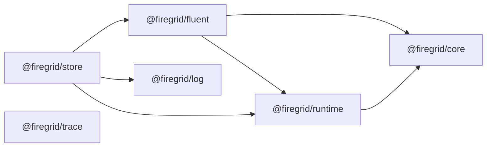
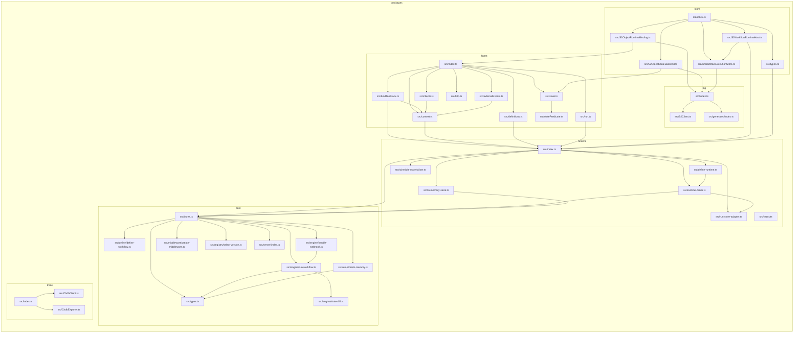

# Current Package Structure

This is the checked-in version of the package-structure sketch from the PR #70
cutover discussion. It describes the production package layout only.

`apps/*` entries are composition examples, ACP process work, and proof harnesses.
They are intentionally excluded from the production runtime package DAG.

## Production Directories

```text
packages/
  core/
    src/
      define/
      engine/
      middleware/
      registry/
      run-store/
      server/
  fluent/
    src/
      bindTanStack.ts
      clients.ts
      combinators.ts
      context.ts
      definitions.ts
      externalEvents.ts
      http.ts
      interface.ts
      run.ts
      state.ts
      statePredicate.ts
  log/
    src/
      generated/
      S2Client.ts
  runtime/
    src/
      define-runtime.ts
      in-memory-store.ts
      run-store-adapter.ts
      runtime-driver.ts
      schedule-materializer.ts
      types.ts
  store/
    src/
      S2ObjectRuntimeBinding.ts
      S2ObjectStateBackend.ts
      S2WorkflowRuntimeHost.ts
      s2WorkflowExecutionStore.ts
      types.ts
  trace/
    src/
      ChdbClient.ts
      ChdbExporter.ts
```

## Current Package DAG

This is the actual package-level import graph generated from
`.dependency-cruiser.cjs` for `packages/*`.



Packages with no Firegrid package dependencies:

- `@firegrid/core`
- `@firegrid/log`
- `@firegrid/trace`

## Source-Level Shape

This is the compact source-file version of the same graph. It is useful when the
package graph looks surprising and the next question is "which files create the
edge?"



## Applications

Applications are composition roots or harnesses, not production runtime packages:

```text
apps/
  examples/full-stack-service/  Node HTTP + S2 composition example
  acp-process/                  ACP process adapter work
  proofs/                       real-substrate verification harness
```

## Cutover Mapping

| Before PR #70 | Current location |
| --- | --- |
| `packages/effect-s2` | `packages/log` |
| `packages/tanstack-workflow-core` | `packages/core` |
| `packages/tanstack-workflow-runtime` | `packages/runtime` |
| `packages/tanstack-workflow-s2` | `packages/store` |
| `packages/fluent-firegrid` | `packages/fluent` |
| `packages/fluent-firegrid-http` | `packages/fluent/src/http.ts` |
| `packages/fluent-firegrid-s2` | `packages/store` |
| `packages/fluent-firegrid-node` | `apps/examples/full-stack-service` |
| `packages/observability` | `packages/trace` |
| `packages/verification` | `apps/proofs` |
| `packages/fluent-acp-process` | `apps/acp-process` |

## Regeneration

The smaller checked-in generated diagrams live beside this file:

- `production-packages.mmd`
- `production-packages.svg`
- `core-focus.svg`
- `fluent-focus.svg`
- `runtime-focus.svg`
- `store-focus.svg`

Regenerate them with the commands in `docs/dependency-cruiser/README.md`.
