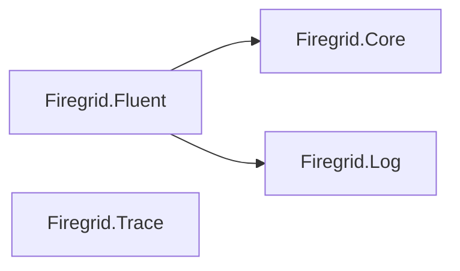
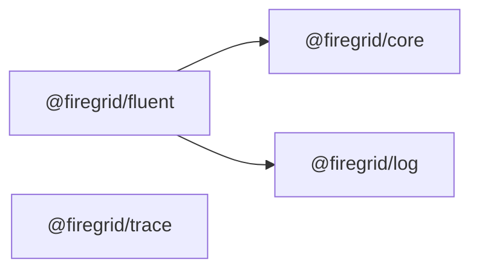

# Current Package Structure

This is the checked-in TypeScript `main` package map after the greenfield
consolidation. Package boundaries should describe stable ownership. Runtime,
clients, and S2 hosting are still evolving together, so they live as subpaths of
`@firegrid/fluent` rather than separate workspace packages.

Do not use this `packages/*` layout as the target mental model for the
`eff-sharp` F#/Fable cutover branch. The F#/Fable branch should be organized
around F# projects and a solution file, not npm workspace packages. Start
consolidated there too, then extract only after the seams are proven.

`apps/*` entries are composition examples, ACP process work, and proof
harnesses. They are intentionally excluded from the production runtime package
DAG.

## Production Directories

Current TypeScript `main` layout:

```text
packages/
  core/
    src/
      define/
      engine/
      middleware/
      registry/
      run-store/
      server/
      invocation.ts
      state.ts
      statePredicate.ts
  fluent/
    src/
      adapters/s2/
      clients/
      runtime/
      bindTanStack.ts
      clients.ts
      combinators.ts
      context.ts
      definitions.ts
      externalEvents.ts
      http.ts
      interface.ts
      run.ts
      state.ts
      statePredicate.ts
      testing/
  log/
    src/
      generated/
      S2Client.ts
  trace/
    src/
      ChdbClient.ts
      ChdbExporter.ts
```

## Public Import Shape

```ts
import { service, object, workflow, run, state } from "@firegrid/fluent"
import { client, sendClient } from "@firegrid/fluent/clients"
import { createWorkflow, defineWorkflowRuntime } from "@firegrid/fluent/runtime"
import { createS2WorkflowRuntimeHost, s2WorkflowExecutionStore } from "@firegrid/fluent/s2"
import { inMemoryWorkflowExecutionStore } from "@firegrid/fluent/testing"
```

Removed greenfield shims:

- `@firegrid/clients`
- `@firegrid/runtime`
- `@firegrid/store`

These had become trivial re-export packages, so keeping them made the package
map noisier without preserving a real external contract.

## F#/Fable Cutover Target

For `eff-sharp`, prefer a source-project-first layout. F# project files are the
real package and dependency boundaries; `package.json` should stay at the root
unless a concrete JS app/package boundary requires its own npm package.

Start with fewer projects:

```text
fluent-firegrid/
  Firegrid.slnx
  global.json
  nuget.config
  Directory.Build.props
  Directory.Packages.props

  src/
    Firegrid.Log/
      Firegrid.Log.fsproj
      S2/
        Types.fs
        InternalSdk.fs
        S2.fs

    Firegrid.Core/
      Firegrid.Core.fsproj
      Types.fs
      Errors.fs
      Invocation.fs
      StatePredicates.fs

    Firegrid.Fluent/
      Firegrid.Fluent.fsproj
      Definitions.fs
      Clients.fs
      Runtime.fs
      S2.fs
      State.fs
      Run.fs

    Firegrid.Trace/
      Firegrid.Trace.fsproj

  tests/
    Firegrid.Fluent.Tests/
      Firegrid.Fluent.Tests.fsproj

  apps/
    NodeHost/
      NodeHost.fsproj

  package.json
  pnpm-lock.yaml
```

Expected F#/Fable project DAG:



`Firegrid.Trace` is a verification/observability support project, not a product
runtime dependency.

F#/Fable cutover rules:

- do not recreate `Clients`, `Runtime`, or `Store` as separate projects until
  the consolidated Fluent internals prove those seams;
- use `src/Firegrid.*/*.fsproj` as the project/package boundary;
- encode dependencies with `ProjectReference`;
- keep a root `Firegrid.slnx` or `Firegrid.sln` as the project index;
- keep root `package.json` for JS/Fable tooling only;
- write generated Fable JavaScript to `dist/` or `build/` and keep it ignored;
- declare native npm dependencies such as `@s2-dev/streamstore` through
  Fable/Femto project metadata, mirroring them in root npm tooling only when
  the build actually needs it.

## Current Package DAG

This is the actual package-level import graph generated from
`.dependency-cruiser.cjs` for `packages/*`.



Packages with no Firegrid package dependencies:

- `@firegrid/core`
- `@firegrid/log`
- `@firegrid/trace`

Forbidden production edges:

- `@firegrid/core` must not depend on any other Firegrid package.
- `@firegrid/log` and `@firegrid/trace` must not depend on product packages.
- `@firegrid/fluent` must not depend on trace sinks or apps.

## Applications

Applications are composition roots or harnesses, not production runtime
packages:

```text
apps/
  examples/full-stack-service/  Node HTTP + S2 composition example
  acp-process/                  ACP process adapter work
  proofs/                       real-substrate verification harness
```

## Cutover Mapping

| Before PR #70 | Current location |
| --- | --- |
| `packages/effect-s2` | `packages/log` |
| `packages/tanstack-workflow-core` | `packages/core` |
| `packages/tanstack-workflow-runtime` | `packages/fluent/src/runtime` |
| `packages/tanstack-workflow-s2` | `packages/fluent/src/adapters/s2` |
| `packages/fluent-firegrid` | `packages/fluent` |
| `packages/fluent-firegrid-http` | `packages/fluent/src/http.ts` |
| `packages/fluent-firegrid-s2` | `packages/fluent/src/adapters/s2` |
| `packages/fluent-firegrid-node` | `apps/examples/full-stack-service` |
| `packages/observability` | `packages/trace` |
| `packages/verification` | `apps/proofs` |
| `packages/fluent-acp-process` | `apps/acp-process` |

## Regeneration

The checked-in generated diagrams live beside this file:

- `production-packages.mmd`
- `production-packages.svg`
- `core-focus.svg`
- `fluent-focus.svg`

Regenerate them with the commands in `docs/dependency-cruiser/README.md`.
