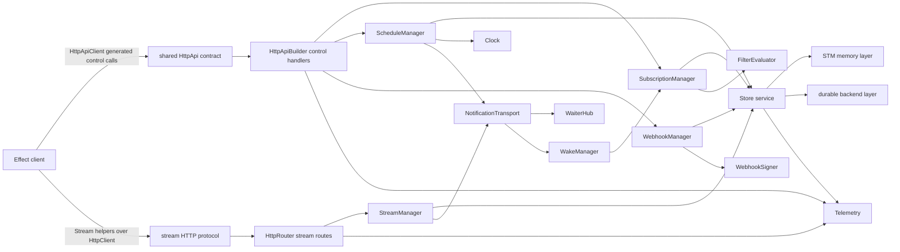
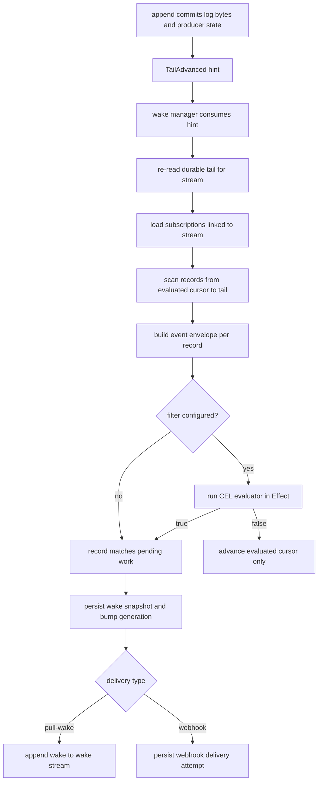
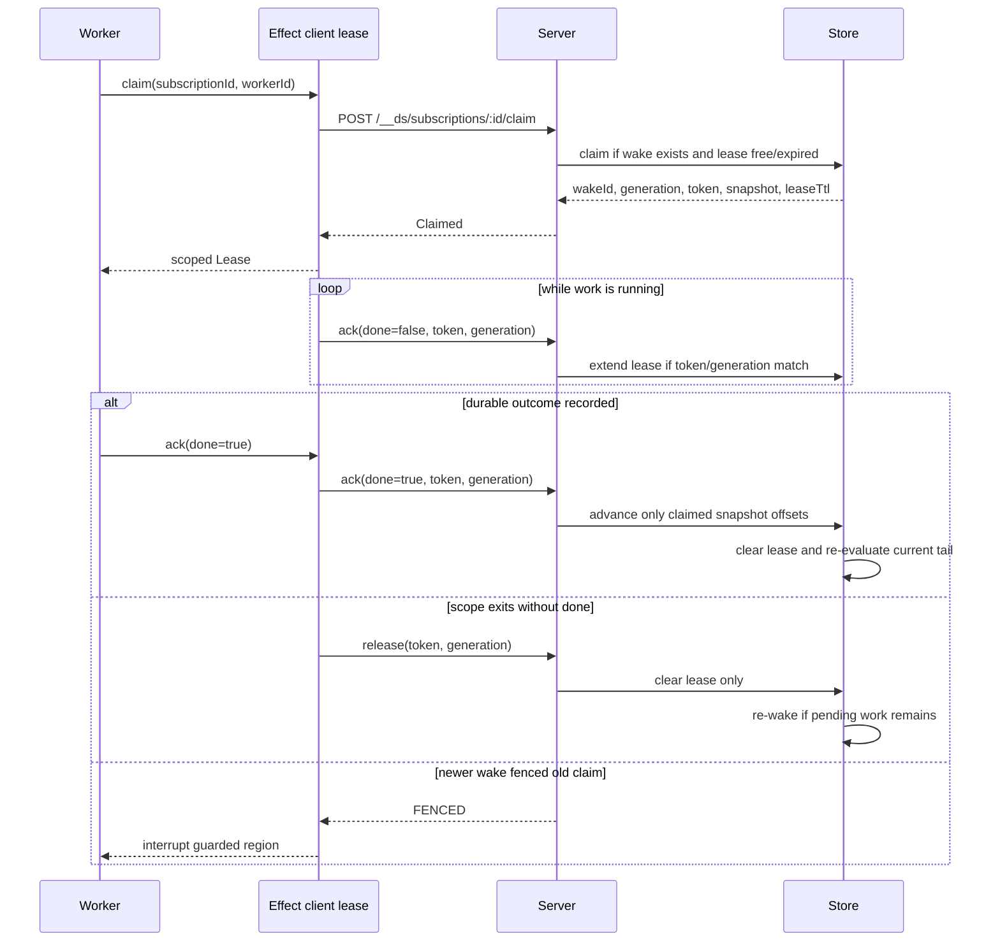
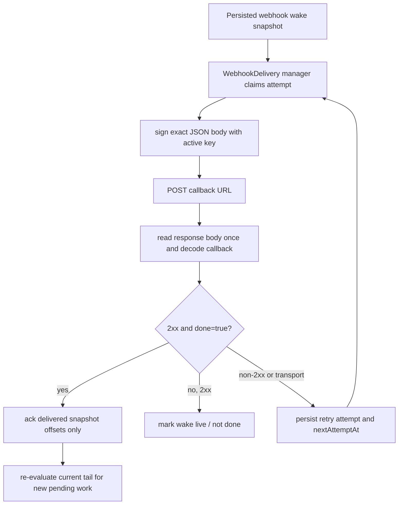
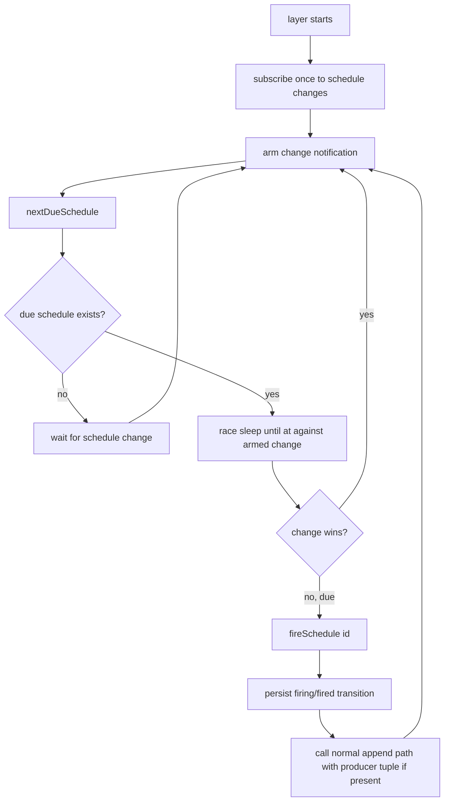

# Effect-native server SDD

Status: draft
Target repo: `gurdasnijor/durable-streams`
Protocol source of truth: `PROTOCOL.md`
Feature spec: `features/durable-streams/effect-server.feature.yaml`
Related feature spec: `features/durable-streams/coordination-substrate.feature.yaml`
Companion client SDD: `docs/sdds/effect-native-client-sdd.md`
Companion execution SDD: `docs/sdds/effect-durable-execution-sdd.md`

## Purpose

This SDD sketches an Effect-native Durable Streams server that can replace the
development TypeScript server for conformance work and eventually become a
production-grade TypeScript server target.

The server should pass `packages/server-conformance-tests`, including the
additional coordination surface added under `PROTOCOL.md`: reserved
subscriptions, pull-wake, webhooks, filters, schedules, producer fencing, and
closed-stream EOF semantics.

`docs/building-a-server.md` is the base protocol build guide. It covers durable
append, offset generation, read from offset, stream metadata, deletion,
idempotent producers, JSON mode, TTL, cache headers, and the upstream server
conformance suite. This SDD extends that base guide with Effect layers, the
ordered key-value durable driver, subscriptions, wake snapshots, schedules,
filters, webhook delivery, and additional pushdown conformance.

The current `packages/server` TypeScript implementation and
`packages/caddy-plugin` production server are references, not compatibility
targets. Server compatibility is defined by `packages/server-conformance-tests`
and any additional conformance added for the new coordination surface. Source or
API compatibility with `packages/server` is a non-goal.

The server should not hardcode a persistence backend. Persistence is an Effect
service supplied by `Layer`. The requirement is a precise store algebra with the
transactional operations needed by the protocol, plus conformance for every
backend layer we advertise.

## Why Effect

The protocol is a good fit for Effect because most server concerns are scoped,
interruptible, and typed:

- HTTP routes are layered and composable.
- Long-poll and SSE are streams.
- Pull-wake claims are scoped leases.
- Webhook callbacks and pull-wake acks are generation-fenced effects.
- Schedules are clock-driven fibers with persisted state.
- Store backends are interchangeable `Layer`s.
- Protocol errors can be modeled as typed errors before lowering to HTTP.
- OpenTelemetry support composes through Effect tracer, logger, and metric
  layers.

The server should use upstream Effect platform patterns from
`repos/effect/packages/platform-node/examples`: `HttpRouter` and
`HttpServer.serve` for protocol-heavy routes, `HttpRouter.Tag` for route module
composition, `NodeHttpServer.layer` for the Node listener, and
`@effect/opentelemetry/NodeSdk.layer` for telemetry.

The server should also use the Effect HTTP API framework more aggressively than
the current client package does. `HttpApi`, `HttpApiGroup`, and
`HttpApiEndpoint` describe structured endpoint contracts; `HttpApiBuilder`
implements those contracts on the server; `HttpApiClient` derives a typed
client from the same contract. That is exactly the right shape for the reserved
control plane.

The split should be:

- `HttpApi` for structured `__ds` routes: subscriptions, stream membership,
  webhook callback, pull-wake claim/ack/release, JWKS, and schedules.
- `HttpRouter` for the stream data plane: arbitrary stream paths, raw byte
  bodies, protocol headers, long-poll, SSE, and cache behavior.

This should reduce the renamed Effect client package,
`packages/effect-durable-client`: the reserved control-plane client should
mostly become `HttpApiClient.make(DurableStreamsApi)` plus semantic wrappers for
scoped leases, producer resources, and webhook verification.

## Component dependencies

The server has three dependency directions:

1. HTTP adapters decode and encode protocol transport.
2. Managers implement state-machine semantics.
3. Store layers provide atomic state transitions.

No manager should depend on a concrete store implementation, and no store should
know about HTTP request/response types.



The important dependency rule is that the shared `HttpApi` contract is a
protocol artifact, not a server-internal artifact. Both server and client can
import it. Server-specific managers and store implementations remain private to
the server package.

## HTTP API contract sharing

The structured control plane should be defined once. The server uses that
definition to build handlers, and the Effect client uses it to derive a typed
client. This prevents a second hand-written catalog of methods, paths, request
schemas, response schemas, and error mappings.

Proposed package placement:

```text
packages/durable-streams-protocol/src/Api.ts
```

or another package-neutral protocol location. It should not live in either the
server or client implementation package if both need to import it:

```text
packages/effect-durable-streams/src/protocol/Api.ts   # server-owned; avoid
packages/effect-durable-client/src/protocol/Api.ts    # client-owned; avoid
```

The API contract should be limited to durable protocol transport. Higher-level
client semantics remain wrappers.

Example contract:

```ts
import {
  HttpApi,
  HttpApiEndpoint,
  HttpApiGroup,
  HttpApiSchema,
} from "@effect/platform"
import { Schema } from "effect"

export class ProtocolError extends Schema.TaggedError<ProtocolError>()(
  "ProtocolError",
  {
    code: Schema.String,
    message: Schema.optional(Schema.String),
  },
  HttpApiSchema.annotations({ status: 400 })
) {}

const subscriptionId = HttpApiSchema.param("id", Schema.String)

export class LinkedStream extends Schema.Class<LinkedStream>("LinkedStream")({
  path: Schema.String,
  link_type: Schema.Literal("glob", "explicit"),
  acked_offset: Schema.String,
}) {}

export class PullWakeSubscription extends Schema.Class<PullWakeSubscription>(
  "PullWakeSubscription"
)({
  type: Schema.Literal("pull-wake"),
  pattern: Schema.optional(Schema.String),
  streams: Schema.optional(Schema.Array(Schema.String)),
  wake_stream: Schema.String,
  lease_ttl_ms: Schema.optional(Schema.Number),
  description: Schema.optional(Schema.String),
}) {}

export class SubscriptionInfo extends Schema.Class<SubscriptionInfo>(
  "SubscriptionInfo"
)({
  id: Schema.String,
  subscription_id: Schema.String,
  type: Schema.Literal("webhook", "pull-wake"),
  pattern: Schema.optional(Schema.String),
  streams: Schema.Array(LinkedStream),
  wake_stream: Schema.NullOr(Schema.String),
  lease_ttl_ms: Schema.Number,
  status: Schema.Literal("active", "failed"),
  description: Schema.optional(Schema.String),
}) {}

export class ClaimRequest extends Schema.Class<ClaimRequest>("ClaimRequest")({
  worker: Schema.String,
}) {}

export class ClaimResponse extends Schema.Class<ClaimResponse>("ClaimResponse")(
  {
    wake_id: Schema.String,
    generation: Schema.Number,
    token: Schema.String,
    streams: Schema.Array(
      Schema.Struct({
        path: Schema.String,
        link_type: Schema.Literal("glob", "explicit"),
        acked_offset: Schema.String,
        tail_offset: Schema.String,
        has_pending: Schema.Boolean,
      })
    ),
    lease_ttl_ms: Schema.Number,
  }
) {}

export class SubscriptionsApi extends HttpApiGroup.make("subscriptions")
  .add(
    HttpApiEndpoint.put("put", `/${subscriptionId}`)
      .setPayload(PullWakeSubscription)
      .addSuccess(SubscriptionInfo, { status: 201 })
      .addError(ProtocolError)
  )
  .add(
    HttpApiEndpoint.get("get", `/${subscriptionId}`)
      .addSuccess(SubscriptionInfo)
      .addError(ProtocolError)
  )
  .add(
    HttpApiEndpoint.post("claim", `/${subscriptionId}/claim`)
      .setPayload(ClaimRequest)
      .addSuccess(ClaimResponse)
      .addError(ProtocolError)
  )
  .prefix("/__ds/subscriptions") {}

export class DurableStreamsApi extends HttpApi.make("durable-streams").add(
  SubscriptionsApi
) {}
```

The final schemas need all webhook, ack, release, stream membership, schedule,
JWKS, and error variants. The example shows the intended shape: transport schema
first, not client abstraction first.

Server implementation:

```ts
import { HttpApiBuilder } from "@effect/platform"
import { Effect, Layer } from "effect"
import { DurableStreamsApi } from "durable-streams-protocol/Api"
import * as Store from "./Store.js"

export const SubscriptionsLive = HttpApiBuilder.group(
  DurableStreamsApi,
  "subscriptions",
  (handlers) =>
    handlers
      .handle("put", ({ path, payload }) =>
        Store.Store.pipe(
          Effect.flatMap((store) => store.putSubscription(path.id, payload))
        )
      )
      .handle("get", ({ path }) =>
        Store.Store.pipe(
          Effect.flatMap((store) => store.getSubscription(path.id))
        )
      )
      .handle("claim", ({ path, payload }) =>
        Store.Store.pipe(
          Effect.flatMap((store) => store.claim(path.id, payload.worker))
        )
      )
)

export const ApiLive = HttpApiBuilder.api(DurableStreamsApi).pipe(
  Layer.provide(SubscriptionsLive)
)
```

Handler effects must be closed over the declared contract errors. If a store or
manager returns an internal error, the handler lowers it to one of the
`HttpApiEndpoint.addError` variants before returning. That keeps the generated
client's error channel aligned with the shared `HttpApi` contract instead of
leaking backend-specific failures into client derivation.

Client derivation:

```ts
import { FetchHttpClient, HttpApiClient, HttpClient } from "@effect/platform"
import { Effect } from "effect"
import { DurableStreamsApi } from "durable-streams-protocol/Api"

export const makeControlClient = (baseUrl: string) =>
  HttpApiClient.make(DurableStreamsApi, {
    baseUrl,
    transformClient: HttpClient.mapRequest((request) => request),
  }).pipe(Effect.provide(FetchHttpClient.layer))
```

That generated client already knows methods, paths, payload encoding, response
decoding, status-based errors, and path/url/header schemas. The custom
`effect-durable-client` code should then add semantics:

```ts
export const claimScoped = (id: string, worker: string) =>
  Effect.acquireUseRelease(
    controlClient.subscriptions.claim({ path: { id }, payload: { worker } }),
    (claim) => runWorkWithClaim(claim),
    (claim) =>
      controlClient.subscriptions.release({
        path: { id },
        payload: {
          wake_id: claim.wake_id,
          generation: claim.generation,
        },
        headers: { Authorization: `Bearer ${claim.token}` },
      })
  )
```

The wrapper owns lease semantics, not HTTP plumbing.

## Persistence decision

The first SDD decision is not "SQLite vs LMDB vs something else". The decision
is:

> `effect-server.STORE.1`: Persistence is supplied through an Effect `Layer`,
> not hardcoded to a concrete database.

That still leaves one real requirement:

> `effect-server.STORE.2`: The store algebra exposes atomic transactions for
> stream append, producer state update, tail-advance recording, and schedule
> status transitions.

Durable backends also need an explicit isolation rule:

> `effect-server.STORE.8`: Durable store implementations serialize
> validate-and-append per `(stream, producerId)` so concurrent appends cannot
> both observe the same prior producer sequence.

This matters because `Layer` only supplies dependencies. It does not by itself
guarantee atomicity, isolation, crash recovery, retention, or restart behavior.
Those are capabilities of the concrete service behind the layer.

The initial implementation should provide:

- `MemoryStore.layer`: development and conformance, backed by Effect STM
  transactional data structures, no production durability.
- `LmdbOrderedKvStore.layer`: interim durable adapter or spike, backed by LMDB
  and exposed through a small ordered transactional key-value driver.
- a SQL/Postgres-compatible durable backend target, preferably PGlite or an
  equivalent embedded Effect SQL layer for local durable development and
  conformance, with Postgres as the production shape when external replication,
  operational tooling, or CEL pushdown is required.

The existing `packages/server/src/file-store.ts` already uses LMDB for durable
metadata and append-only log files for stream bytes. The Effect-native server
should lift the durable persistence seam one level lower: LMDB becomes an
ordered key-value driver behind the Effect server store, while the public
`Store` service remains protocol/domain-shaped.

When additional durable backends are added, `effect-server.STORE.8` is the fork
point:
Cloudflare Durable Objects satisfy per-stream serialization structurally if a
stream's appends are colocated in one object. SQL backends do not get this from
default Read Committed isolation; they need `SERIALIZABLE` with
serialization-failure retry, a `FOR UPDATE` lock on producer state, or a
per-stream advisory lock. The §5.2.1 producer-state-plus-log atomicity must
hold inside the same locked transaction, otherwise a crash between log append
and producer-state update reopens the deduplication window.

The memory backend passing concurrent append tests is not evidence that a SQL
adapter is safe, because STM supplies serialization structurally. Durable
backend conformance needs its own concurrent same-stream producer append test.
It also needs crash/retry conformance proving producer-state and log append
atomicity. Higher-level execution consumers rely on that boundary to ensure a
durable fact append and its producer dedupe state cannot split across a crash.

## SQL-shaped durable storage and colocated host observation

The strategic durable backend should be SQL-shaped rather than KV-shaped. The
domain `Store` can be implemented directly with `@effect/sql` tables and
transactions:

```text
stream_events        authoritative append facts
stream_tails         per-stream tail, content type, close, retention metadata
producer_state       producer id, epoch, highest accepted seq
subscriptions        config, linked streams, public ack cursor, evaluated cursor
wake_snapshots       generation-fenced pending work snapshots
schedules            due time, target stream, producer tuple, status
state_changes        authoritative State Protocol change facts
state_current        derived current rows for wait/query paths
ready_invocations    derived host activation rows
```

Append transactions update authoritative tables and any cheap derived query
tables in the same commit:

```text
append transaction:
  validate stream and producer tuple
  insert stream_events
  update stream_tails and producer_state
  insert tail-advance / wake hint
  update derived state_current or ready_invocations rows when applicable
  commit
```

This covers `effect-server.STORE.13` and `effect-server.STORE.14`.

PGlite is a good first local SQL target because it is embedded,
Postgres-compatible, and has an Effect SQL adapter in the current Effect v4
line. In the current Effect v3 workspace this may require either waiting for the
repo's Effect version move or adapting only the small client wrapper locally.
The store algebra should not depend on PGlite-specific APIs; it should depend on
the domain `Store` and, for SQL backends, ordinary `SqlClient` transactions.

PGlite live queries are useful as a colocated host observation transport. The
host can subscribe to derived SQL tables such as `ready_invocations`,
`wake_snapshots`, or `state_current` and receive inserts, updates, and deletes
without polling the external pull-wake HTTP endpoint. This can shrink the
internal server-to-host wiring:

```text
SQL/PGlite store commit
  -> ready_invocations row changes
  -> host live.changes / live.incrementalQuery observer
  -> host claims activation in SQL transaction
  -> host replays operation log and runs missing work
  -> host records outcome or suspension intent
  -> host acks only after the durable record exists
```

Live queries are an optimization over derived tables, not the source of
correctness. The source of correctness remains the authoritative append log,
producer state, wake snapshots, and execution operation log. Pull-wake remains
the portable external protocol for non-colocated workers and clients. This
covers `effect-server.WAKE.7`.

SQL CEL pushdown should be capability-detected. If a Postgres-shaped backend has
a CEL evaluator such as `pg-cel`, the wake evaluator can push predicates into
SQL over JSON/event envelopes. If the capability is absent, including an
embedded PGlite deployment without a CEL extension package, the wake evaluator
falls back to server-side Effect CEL evaluation while preserving the same wake
decisions. This covers `effect-server.WAKE.8`.

The store transaction boundary is append durability, not wake delivery. A stream
append transaction commits log bytes, stream metadata, producer state, and a
tail-advance record. Wake evaluation consumes the tail-advance signal after the
append commits. This split is required once filtered subscriptions exist:
server-side CEL evaluation is an `Effect`, and arbitrary effects cannot run
inside STM or inside a repeatable durable transaction.

This gives the durable backends the same seam as the STM backend:

```text
append transaction:
  validate closed/content-type/stream-seq/producer
  append bytes or JSON messages
  update stream tail and producer state
  record TailAdvanced(stream, tail)
  commit

wake subsystem:
  consume TailAdvanced
  scan linked subscriptions from public ack or internal evaluated cursor
  evaluate CEL filters as Effect
  bump generation and create wake when pending work exists
  dispatch webhook or append pull-wake event
```

This covers `effect-server.STORE.1`, `effect-server.STORE.2`, and
`effect-server.STORE.8` through `effect-server.STORE.12`.

## Ordered key-value driver

The Effect server store should not expose LMDB directly, and it should not use
`@effect/platform` `KeyValueStore` as its core abstraction. `KeyValueStore`
provides simple point `get`/`set`/`remove` operations, but the server needs
ordered range scans, multi-key atomic updates, and transaction-local reads for
append and wake state machines.

Use a lower driver algebra for durable key/value backends:

```ts
import { Context, Data, Effect, Option, Stream } from "effect"

export class StoreDriverError extends Data.TaggedError("StoreDriverError")<{
  readonly cause: unknown
}> {}

export interface KvEntry {
  readonly key: Uint8Array
  readonly value: Uint8Array
}

export interface KeyRange {
  readonly start: Uint8Array
  readonly end: Uint8Array
  readonly limit?: number
  readonly reverse?: boolean
}

export interface OrderedKvTxn {
  readonly get: (key: Uint8Array) => Option.Option<Uint8Array>
  readonly put: (key: Uint8Array, value: Uint8Array) => void
  readonly remove: (key: Uint8Array) => void
  readonly scan: (range: KeyRange) => Iterable<KvEntry>
}

export interface OrderedKvStoreService {
  readonly get: (
    key: Uint8Array
  ) => Effect.Effect<Option.Option<Uint8Array>, StoreDriverError>
  readonly put: (
    key: Uint8Array,
    value: Uint8Array
  ) => Effect.Effect<void, StoreDriverError>
  readonly remove: (key: Uint8Array) => Effect.Effect<void, StoreDriverError>
  readonly scan: (range: KeyRange) => Stream.Stream<KvEntry, StoreDriverError>

  readonly writeTxn: <A>(
    f: (txn: OrderedKvTxn) => A
  ) => Effect.Effect<A, StoreDriverError>
}

export class OrderedKvStore extends Context.Tag(
  "effect-durable-streams/OrderedKvStore"
)<OrderedKvStore, OrderedKvStoreService>() {}
```

`writeTxn` is intentionally a synchronous callback. LMDB transactions are
synchronous callbacks, and arbitrary `Effect` values must not run inside a
repeatable storage transaction. The higher `Store` service owns the Effectful
workflow around the transaction: decode input, call the synchronous transaction,
then publish notifications or run wake evaluation after commit.
The low driver can represent missing keys as `Option.None` or `undefined`; the
domain `Store` normalizes that detail before applying protocol decisions.

Physical key layout should be table-shaped over ordered keys while preserving
stream semantics:

```text
stream:{path}                         -> StreamMetadata
record:{path}:{offset}                -> RecordEnvelope
producer:{path}:{producerId}          -> ProducerState
sub:{id}                              -> SubscriptionState
sub_by_stream:{path}:{id}             -> link marker
wake:{subscriptionId}:{generation}    -> WakeSnapshot
schedule:{id}                         -> ScheduleRecord
schedule_due:{at}:{id}                -> index marker
```

That layout lets one LMDB transaction commit append record, stream tail,
producer state, and tail-advance fact atomically. It also gives wake evaluation
the range scans it needs for `effect-server.WAKE.6` and
`effect-server.CONFORMANCE.8`.

An optional adapter can expose LMDB through `@effect/platform` `KeyValueStore`
for simple utilities, but not for the core Durable Streams server store. This is
the boundary specified by `effect-server.STORE.9` through
`effect-server.STORE.12`.

## STM-backed memory store

Effect STM is the right implementation substrate for the in-memory backend.
`repos/effect/packages/effect/src/STM.ts` defines `STM<A, E, R>` as a
transactional effect and exposes `STM.commit` to run a transaction atomically.
The same package provides transactional data structures such as `TRef`, `TMap`,
`TQueue`, and `TSubscriptionRef`.

This directly matches the memory-store problem:

- stream records, producer state, subscriptions, schedules, and wake indexes can
  live in `TMap`s;
- per-stream counters and clock-derived test state can live in `TRef`s;
- waiter and wake notifications can use `TQueue` or `TSubscriptionRef`;
- append validation, append mutation, producer state update, tail-advance
  recording, and schedule status transition can compose into a single STM
  transaction.

The memory store should not use a plain `Ref` with hand-rolled critical
sections. STM gives us composable fiber-safe transactions while keeping the
route and manager code identical to durable backends.

Example memory-store state:

```ts
import { Context, Effect, Layer, STM, TMap, TQueue, TRef } from "effect"
import * as Store from "./Store.js"

interface MemoryState {
  readonly streams: TMap.TMap<Store.StreamPath, StreamRecord>
  readonly subscriptions: TMap.TMap<Store.SubscriptionId, SubscriptionRecord>
  readonly schedules: TMap.TMap<string, ScheduleRecord>
  readonly tailAdvances: TQueue.TQueue<Store.TailAdvanced>
}

const makeState = STM.gen(function* () {
  return {
    streams: yield* TMap.empty<Store.StreamPath, StreamRecord>(),
    subscriptions: yield* TMap.empty<
      Store.SubscriptionId,
      SubscriptionRecord
    >(),
    schedules: yield* TMap.empty<string, ScheduleRecord>(),
    tailAdvances: yield* TQueue.unbounded<Store.TailAdvanced>(),
  } satisfies MemoryState
})

export const layer = Layer.effect(
  Store.Store,
  Effect.gen(function* () {
    const state = yield* STM.commit(makeState)
    return makeStore(state)
  })
)
```

Example append transaction:

```ts
import { Option, STM, TMap, TQueue, TRef } from "effect"

const appendSTM = (
  state: MemoryState,
  input: Store.AppendInput
): STM.STM<Store.AppendResult, ProtocolError> =>
  STM.gen(function* () {
    const stream = yield* getStreamForAppend(state.streams, input.path)
    const decision = yield* decideAppend(stream, input)

    if (
      decision._tag !== "PlainAccepted" &&
      decision._tag !== "ProducerAccepted"
    ) {
      return { append: decision, tailAdvanced: Option.none() }
    }

    const nextOffset = nextOffsetFor(stream, input)
    const updated = appendToRecord(stream, input, nextOffset)

    yield* TMap.set(state.streams, input.path, updated)
    yield* persistProducerState(updated, input.producer)

    const tailAdvanced = {
      path: input.path,
      tailOffset: nextOffset,
      closed: updated.closed,
    }
    yield* TQueue.offer(state.tailAdvances, tailAdvanced)

    return {
      append: { ...decision, nextOffset, closed: updated.closed },
      tailAdvanced: Option.some(tailAdvanced),
    }
  })

const append = (state: MemoryState, input: Store.AppendInput) =>
  STM.commit(appendSTM(state, input))
```

The example is illustrative, not a final API. The design requirement is that the
append decision and mutations are one STM transaction for the memory backend;
wake evaluation is not part of that transaction.

## Package shape

Proposed package path:

```text
packages/effect-durable-streams
```

Proposed public exports:

```text
src/index.ts
src/Server.ts
src/Config.ts
src/ProtocolError.ts
src/ControlApi.ts
src/Store.ts
src/storage/OrderedKvStore.ts
src/storage/LmdbOrderedKvStore.ts
src/storage/KeyCodec.ts
src/MemoryStore.ts
src/KvStore.ts
src/managers/StreamManager.ts
src/managers/WakeManager.ts
src/routes/StreamRoutes.ts
src/subscriptions/SubscriptionManager.ts
src/schedules/ScheduleManager.ts
src/webhooks/WebhookDelivery.ts
src/schedules/ScheduleRunner.ts
src/telemetry.ts
```

Naming can change during implementation, but module boundaries should remain:
routes decode and encode HTTP; managers implement protocol state machines; store
layers own persistence.

Package naming is now part of the SDD contract:

- `effect-server.PACKAGE.1`: `packages/effect-durable-streams` is the
  Effect-native server implementation.
- `effect-server.PACKAGE.2`: the current Effect client package should move to a
  client-specific name such as `packages/effect-durable-client`.
- `effect-server.PACKAGE.3`: shared `HttpApi` protocol schemas should live in a
  package-neutral module imported by both sides.

## Runtime layers

The launched server should be a normal Effect layer graph.

```ts
import { HttpMiddleware, HttpRouter, HttpServer } from "@effect/platform"
import { NodeHttpServer, NodeRuntime } from "@effect/platform-node"
import { Layer } from "effect"
import { createServer } from "node:http"
import * as ControlApi from "./ControlApi.js"
import * as KvStore from "./KvStore.js"
import * as LmdbOrderedKvStore from "./storage/LmdbOrderedKvStore.js"
import * as MemoryStore from "./MemoryStore.js"
import * as ScheduleRunner from "./schedules/ScheduleRunner.js"
import * as Server from "./Server.js"
import * as Telemetry from "./telemetry.js"

const HttpLive = HttpRouter.Default.unwrap(
  HttpServer.serve(HttpMiddleware.logger)
).pipe(
  Layer.provide(Server.RoutesLive),
  Layer.provide(ControlApi.Live),
  Layer.provide(MemoryStore.layer),
  Layer.provide(ScheduleRunner.layer),
  Layer.provide(Telemetry.layer),
  HttpMiddleware.withSpanNameGenerator(Server.spanName),
  Layer.provide(NodeHttpServer.layer(createServer, { port: 4437 }))
)

NodeRuntime.runMain(Layer.launch(HttpLive))
```

This demonstrates the core architectural point: swapping persistence is changing
`Layer.provide(MemoryStore.layer)` to another store layer, not changing route
code. The durable LMDB path should compose as:

```ts
const LmdbStoreLive = KvStore.layer.pipe(
  Layer.provide(LmdbOrderedKvStore.layer({ path: "./data/effect-server.lmdb" }))
)
```

where `LmdbOrderedKvStore.layer` owns the scoped LMDB resource and
`KvStore.layer` adapts the ordered key-value driver into the protocol/domain
`Store` algebra.

## Store algebra

The store should expose protocol decisions rather than database details.

```ts
import { Context, Effect, Option, Stream } from "effect"

export type Offset = string
export type StreamPath = string
export type SubscriptionId = string
export type ScheduleId = string

export interface AppendInput {
  readonly path: StreamPath
  readonly contentType: string
  readonly body: Uint8Array
  readonly close: boolean
  readonly streamSeq: Option.Option<string>
  readonly producer: Option.Option<{
    readonly id: string
    readonly epoch: number
    readonly seq: number
  }>
}

export type AppendDecision =
  | {
      readonly _tag: "PlainAccepted"
      readonly nextOffset: Offset
      readonly closed: boolean
    }
  | {
      readonly _tag: "ProducerAccepted"
      readonly nextOffset: Offset
      readonly closed: boolean
      readonly producerEpoch: number
      readonly highestAcceptedSeq: number
    }
  | {
      readonly _tag: "ProducerDuplicate"
      readonly nextOffset: Offset
      readonly closed: boolean
      readonly producerEpoch: number
      readonly highestAcceptedSeq: number
    }
  | { readonly _tag: "ProducerFenced"; readonly currentEpoch: number }
  | {
      readonly _tag: "ProducerGap"
      readonly expectedSeq: number
      readonly receivedSeq: number
    }
  | { readonly _tag: "ClosedConflict"; readonly finalOffset: Offset }
  | { readonly _tag: "ContentTypeMismatch" }
  | { readonly _tag: "StreamSeqRegression" }

export interface TailAdvanced {
  readonly path: StreamPath
  readonly tailOffset: Offset
  readonly closed: boolean
}

export interface AppendResult {
  readonly append: AppendDecision
  readonly tailAdvanced: Option.Option<TailAdvanced>
}

export interface StreamTail {
  readonly path: StreamPath
  readonly tailOffset: Offset
  readonly closed: boolean
}

export interface Store {
  readonly append: (
    input: AppendInput
  ) => Effect.Effect<AppendResult, ProtocolError>

  readonly read: (
    path: StreamPath,
    offset: Offset
  ) => Effect.Effect<ReadChunk, ProtocolError>

  readonly longPoll: (
    input: LongPollInput
  ) => Effect.Effect<LongPollResult, ProtocolError>

  readonly sse: (input: SseInput) => Stream.Stream<SseEvent, ProtocolError>

  readonly currentTail: (
    path: StreamPath
  ) => Effect.Effect<StreamTail, ProtocolError>

  readonly listStreams: (
    pattern: string
  ) => Effect.Effect<ReadonlyArray<StreamSnapshot>, ProtocolError>

  readonly subscriptionsForStream: (
    path: StreamPath
  ) => Effect.Effect<ReadonlyArray<SubscriptionSnapshot>, ProtocolError>

  readonly createWake: (
    input: WakeInput
  ) => Effect.Effect<WakeDecision, ProtocolError>

  readonly claim: (
    subscriptionId: SubscriptionId,
    worker: string
  ) => Effect.Effect<ClaimDecision, ProtocolError>

  readonly ack: (input: AckInput) => Effect.Effect<AckDecision, ProtocolError>

  readonly createSchedule: (
    input: ScheduleInput
  ) => Effect.Effect<ScheduleDecision, ProtocolError>

  readonly nextDueSchedule: Effect.Effect<
    Option.Option<ScheduleSnapshot>,
    ProtocolError
  >

  readonly fireSchedule: (
    id: ScheduleId
  ) => Effect.Effect<ScheduleFireDecision, ProtocolError>
}

export class Store extends Context.Tag("@durable-streams/effect-server/Store")<
  Store,
  Store
>() {}
```

`append` is intentionally the atomic operation. It validates protocol append
precedence, appends data, updates stream metadata, updates producer state, and
records tail advancement. Wake evaluation is downstream.

All append conflicts that affect §5.2 precedence are `AppendDecision` variants,
not split between a success channel and a generic `ProtocolError`. That keeps
closed-stream conflict ahead of content-type mismatch ahead of stream sequence
regression in one decision path, ensuring closed-stream conflicts include
`Stream-Closed: true`.

The read operations are explicit because read-side conformance is not a small
detail: catch-up, long-poll, SSE, fork stitching, ETags, `offset=now`,
retention, cursor monotonicity, and EOF all live here.

## Offsets

Offsets are stream-local. The server must not allocate from one global counter,
because that serializes unrelated streams and does not match the protocol's
per-stream monotonicity requirement. A backend can use either:

- a per-stream sequence stored with the stream metadata; or
- a lexicographically ordered, branded ID such as an ULID, if the backend can
  prove monotonic ordering per stream.

`Stream-Next-Offset` is the tail after the append, not the offset of the record
just written. For a stream-local sequence backend, appending one logical record
at tail `41` returns `42`; appending a batch returns the post-batch tail. Forked
streams preserve the source stream's offset space for inherited data and then
continue from their own tail without translating client cursors.

## Route composition

The structured control plane should be mounted as the shared `HttpApi`
application. The raw stream plane remains hand-routed through `HttpRouter`.
Mount the control API before the application stream catch-all routes.

```ts
import { HttpApiBuilder, HttpRouter } from "@effect/platform"
import { Effect, Layer } from "effect"
import * as StreamRoutes from "./routes/StreamRoutes.js"

export const RoutesLive = HttpRouter.Default.use((router) =>
  Effect.gen(function* () {
    yield* router.mountApp("/v1/stream", yield* HttpApiBuilder.httpApp, {
      includePrefix: false,
    })

    yield* router.put("/v1/stream/*", StreamRoutes.create)
    yield* router.post("/v1/stream/*", StreamRoutes.append)
    yield* router.head("/v1/stream/*", StreamRoutes.head)
    yield* router.get("/v1/stream/*", StreamRoutes.read)
    yield* router.del("/v1/stream/*", StreamRoutes.remove)
  })
).pipe(Layer.provide(StreamRoutes.Live))
```

This satisfies `effect-server.HTTP.1`: application stream paths whose first
stream-root-relative segment is `__ds` are reserved control paths.

This also satisfies `effect-server.HTTP_API.2`: the control paths are not
hand-coded twice. `ControlApi.Live` implements the shared `HttpApi` contract,
and `RoutesLive` mounts that app ahead of stream routes.

## Stream append route

The stream route owns HTTP decoding and response lowering. It should not own
producer state or subscription state.

```ts
import { HttpServerRequest, HttpServerResponse } from "@effect/platform"
import { Effect, Option } from "effect"
import * as NotificationTransport from "../NotificationTransport.js"
import * as Store from "../Store.js"
import * as Protocol from "../protocol.js"

export const append = Effect.gen(function* () {
  const request = yield* HttpServerRequest.HttpServerRequest
  const store = yield* Store.Store
  const notifications = yield* NotificationTransport.NotificationTransport

  const body = new Uint8Array(yield* request.arrayBuffer)
  const input = yield* Protocol.decodeAppend(request, body)

  const result = yield* store.append(input).pipe(
    Effect.withSpan("stream.append"),
    Effect.annotateSpans({
      "ds.stream": input.path,
      "ds.close": input.close,
    })
  )

  if (Option.isSome(result.tailAdvanced)) {
    yield* notifications.publishTailAdvanced(result.tailAdvanced.value)
  }

  return yield* Protocol.appendDecisionToResponse(result.append)
})

export const appendDecisionToResponse = (decision: Store.AppendDecision) => {
  switch (decision._tag) {
    case "PlainAccepted":
      return HttpServerResponse.empty({
        status: 204,
        headers: {
          "Stream-Next-Offset": decision.nextOffset,
          ...(decision.closed ? { "Stream-Closed": "true" } : {}),
        },
      })
    case "ProducerAccepted":
      return HttpServerResponse.empty({
        status: 200,
        headers: {
          "Stream-Next-Offset": decision.nextOffset,
          "Producer-Epoch": String(decision.producerEpoch),
          "Producer-Seq": String(decision.highestAcceptedSeq),
          ...(decision.closed ? { "Stream-Closed": "true" } : {}),
        },
      })
    case "ProducerDuplicate":
      return HttpServerResponse.empty({
        status: 204,
        headers: {
          "Stream-Next-Offset": decision.nextOffset,
          "Producer-Epoch": String(decision.producerEpoch),
          "Producer-Seq": String(decision.highestAcceptedSeq),
          ...(decision.closed ? { "Stream-Closed": "true" } : {}),
        },
      })
    case "ProducerFenced":
      return HttpServerResponse.empty({
        status: 403,
        headers: { "Producer-Epoch": String(decision.currentEpoch) },
      })
    case "ProducerGap":
      return HttpServerResponse.empty({
        status: 409,
        headers: {
          "Producer-Expected-Seq": String(decision.expectedSeq),
          "Producer-Received-Seq": String(decision.receivedSeq),
        },
      })
    case "ClosedConflict":
      return HttpServerResponse.empty({
        status: 409,
        headers: {
          "Stream-Closed": "true",
          "Stream-Next-Offset": decision.finalOffset,
        },
      })
    case "ContentTypeMismatch":
    case "StreamSeqRegression":
      return HttpServerResponse.empty({ status: 409 })
  }
}
```

The route is deliberately thin. The important append semantics live in the
store transaction and can be tested without HTTP.

`Protocol.decodeAppend` owns JSON append normalization before the store sees the
input: one-level array flattening, preserving JSON message boundaries, rejecting
empty arrays on `POST`, and allowing `PUT` to create an empty stream. Producer
responses report the highest accepted sequence for the tuple, including
duplicates, so a pipelined client can recover after crash without guessing which
sequence committed.

## Wake notification transport

Wake notification is a separate layer from storage. Memory can use STM queues or
subscription refs. Durable multi-process backends need a transport such as
Postgres `LISTEN/NOTIFY`, Durable Object colocated waiters, a pub/sub bus, or an
adapter-specific equivalent.

The offset remains the source of truth. A dropped notification is allowed to
fall back to long-poll timeout and re-read from the durable tail, but a
production backend must still provide a notification path so waiters on node A
can wake after an append on node B.

```ts
import { Context, Effect, Stream } from "effect"
import * as Store from "./Store.js"

export interface ChangeSubscription {
  readonly arm: Effect.Effect<Effect.Effect<void>>
}

export interface NotificationTransport {
  readonly publishTailAdvanced: (
    event: Store.TailAdvanced
  ) => Effect.Effect<void>

  readonly tailAdvanced: Stream.Stream<Store.TailAdvanced>

  readonly subscribeStream: (
    path: Store.StreamPath
  ) => Stream.Stream<Store.TailAdvanced>

  readonly subscribeSchedulesChanged: Effect.Effect<ChangeSubscription>
  readonly publishSchedulesChanged: Effect.Effect<void>
}

export class NotificationTransport extends Context.Tag(
  "@durable-streams/effect-server/NotificationTransport"
)<NotificationTransport, NotificationTransport>() {}
```

The stream append route publishes `TailAdvanced` only after `store.append`
commits. The wake manager and live-read waiters both subscribe to this transport.
For durable transports, `TailAdvanced.tailOffset` is a hint, not truth:
`LISTEN/NOTIFY`-style systems can reorder, drop, or coalesce notifications. Wake
evaluation and live reads re-read the current durable tail before deciding
pending work or returning to clients.

## Wake evaluation

Wake evaluation consumes tail-advance events. It owns subscription pending-work
checks, filtered evaluation, generation bump, lease checks, and dispatch. It is
not part of the append transaction.

End-to-end, filter evaluation happens against durable stream records, not an
in-memory state table:



The `TailAdvanced` offset is only a scheduling hint. The evaluator re-reads
tail, then asks the store for the durable records between the link's internal
evaluated cursor and that tail. For each record it builds an envelope containing
the decoded value and metadata, evaluates the configured filter if present, and
persists a wake snapshot for matching records. Non-matching records advance only
the internal evaluated cursor. Matching records do not advance the public
`acked_offset`; public ack advances only through webhook callback or pull-wake
ack.

```ts
export const WakeManagerLive = Layer.scopedDiscard(
  Effect.gen(function* () {
    const notifications = yield* NotificationTransport.NotificationTransport
    const store = yield* Store.Store
    const filters = yield* FilterEvaluator

    yield* notifications.tailAdvanced.pipe(
      Stream.runForEach((advanced) =>
        Effect.gen(function* () {
          const tail = yield* store.currentTail(advanced.path)
          const candidates = yield* store.subscriptionsForStream(advanced.path)

          for (const subscription of candidates) {
            const decision = yield* evaluatePendingWork(
              filters,
              subscription,
              tail
            )
            if (decision._tag === "Wake") {
              yield* store.createWake(decision)
            }
          }
        }).pipe(
          Effect.withSpan("subscription.evaluateWake"),
          Effect.annotateSpans({ "ds.stream": advanced.path })
        )
      ),
      Effect.forkScoped
    )
  })
)
```

Filtered subscriptions keep two rates of progress:

- public `acked_offset`, advanced only by callback or pull-wake ack; and
- internal evaluated offset, advanced by the wake evaluator while scanning
  non-matching events.

This matches `PROTOCOL.md` §7.4.1 and keeps CEL evaluation outside STM. It
covers `effect-server.WAKE.1` through `effect-server.WAKE.6` and
`effect-server.FILTERS.1` through `effect-server.FILTERS.5`.

## Read and live read

Long-poll and SSE should be modeled as `Stream` and interruption-aware effects.
They need first-class conformance coverage because most subtle protocol bugs are
read-side bugs.

Read responsibilities:

- `offset=-1` and `offset=now` sentinels;
- retention/compaction `410`;
- fork stitching and fork-specific live wait behavior;
- JSON message boundary preservation;
- `Cache-Control` from TTL/expiry;
- `Stream-Up-To-Date` distinct from `Stream-Closed`;
- EOF signaling at tail;
- ETags that vary with closure status, for example `stream:start:end:c`; and
- monotonic cursor generation for long-poll headers and SSE control events.

```ts
import { HttpServerResponse } from "@effect/platform"
import { Effect, Stream } from "effect"
import * as Store from "../Store.js"
import * as Sse from "../sse.js"

export const readSse = (path: string, offset: string) =>
  Effect.gen(function* () {
    const store = yield* Store.Store

    const events = store
      .sse({ path, offset })
      .pipe(Stream.map(Sse.encodeEvent), Stream.encodeText)

    return HttpServerResponse.stream(events, {
      status: 200,
      contentType: "text/event-stream",
      headers: {
        "Cache-Control": "no-store",
        "X-Content-Type-Options": "nosniff",
      },
    })
  }).pipe(
    Effect.withSpan("stream.read.sse"),
    Effect.annotateSpans({ "ds.stream": path })
  )
```

SSE should not rely on indefinite comment heartbeats as the primary model. The
protocol recommends closing connections around the collapse interval so clients
reconnect using the last `streamNextOffset`, unless EOF has been observed.

Long-poll is a separate operation, not an SSE variant:

```ts
export const readLongPoll = (input: Store.LongPollInput) =>
  Store.Store.pipe(
    Effect.flatMap((store) => store.longPoll(input)),
    Effect.flatMap((result) => Protocol.longPollResultToResponse(result))
  )
```

Long-poll must return immediately when the stream is closed and the requested
offset is at the tail, must wait immediately from `offset=now`, and must not let
source-stream appends wake a fork waiter that is waiting at the fork tail.
`longPoll` and `sse` own a subscribe-before-check sequence: create the
backend-specific live subscription first, then re-read current tail, then race
the wait against timeout or stream closure. That ordering prevents an append
from landing between "tail is unchanged" and "waiter is parked." Fork live
subscriptions also filter source-origin advances when the waiter is parked at
the fork tail. Every return path, including `204`, applies cursor monotonicity:
if the client cursor is greater than or equal to the current interval, return a
strictly greater jittered cursor.

## Subscription state

Subscription operations should be state-machine operations over a durable
record, not independent route handlers.

```ts
export interface SubscriptionState {
  readonly id: string
  readonly configHash: string
  readonly delivery:
    | { readonly _tag: "Webhook"; readonly url: URL }
    | { readonly _tag: "PullWake"; readonly wakeStream: StreamPath }
  readonly links: ReadonlyMap<
    StreamPath,
    {
      readonly linkType: "glob" | "explicit"
      readonly ackedOffset: Offset
      readonly evaluatedOffset: Option.Option<Offset>
    }
  >
  readonly generation: number
  readonly wakeId: Option.Option<string>
  readonly lease: Option.Option<{
    readonly holder: string
    readonly tokenId: string
    readonly expiresAt: Date
  }>
  readonly retry: Option.Option<{
    readonly nextAttemptAt: Date
    readonly attempts: number
  }>
}
```

The server should increment `generation` for each wake. A callback, ack, or
release must match the current generation, wake id, and token before it can
advance cursors.

## Pull-wake claim scope

The server endpoint issues a token; the client models that token as a scoped
lease. On the server, claim is just a fenced state transition.



The snapshot is important: the claim is over the records that caused the wake,
not "whatever the stream tail is now." This is the same safety rule as webhook
ack. It prevents work that arrived during processing from being silently acked
by an older worker.

```ts
export const claim = Effect.gen(function* () {
  const request = yield* HttpServerRequest.HttpServerRequest
  const store = yield* Store.Store
  const input = yield* ClaimPayload.decodeRequest(request)

  const decision = yield* store.claim(input.subscriptionId, input.worker).pipe(
    Effect.withSpan("subscription.claim"),
    Effect.annotateSpans({
      "ds.subscription": input.subscriptionId,
    })
  )

  switch (decision._tag) {
    case "Claimed":
      return yield* HttpServerResponse.json({
        wake_id: decision.wakeId,
        generation: decision.generation,
        token: decision.token,
        streams: decision.streams,
        lease_ttl_ms: decision.leaseTtlMs,
      })
    case "AlreadyClaimed":
      return yield* HttpServerResponse.json(
        {
          error: {
            code: "ALREADY_CLAIMED",
            current_holder: decision.currentHolder,
            generation: decision.generation,
          },
        },
        { status: 409 }
      )
  }
})
```

Ack without `done: true` is heartbeat. Ack with `done: true` advances the
claimed wake snapshot and releases the lease. Release drops the lease without
advancing cursors.

This covers `effect-server.PULL_WAKE.1` through
`effect-server.PULL_WAKE.5`.

## Webhook delivery

Webhook delivery should be a manager fiber driven by persisted wake decisions.
Signing is a service so key storage and rotation can change independently.



```ts
export interface WebhookSigner {
  readonly jwks: Effect.Effect<JsonWebKeySet>
  readonly sign: (body: Uint8Array) => Effect.Effect<{
    readonly header: string
    readonly kid: string
  }>
}

export class WebhookSigner extends Context.Tag(
  "@durable-streams/effect-server/WebhookSigner"
)<WebhookSigner, WebhookSigner>() {}

export const deliver = (wake: WebhookWake) =>
  Effect.gen(function* () {
    const signer = yield* WebhookSigner.WebhookSigner
    const body = Json.encode(wake.payload)
    const signature = yield* signer.sign(body)

    const response = yield* HttpClient.post(wake.url, {
      body,
      headers: {
        "Content-Type": "application/json",
        "Webhook-Signature": signature.header,
      },
    })

    const callback = yield* decodeWebhookCallback(response)

    if (response.status === 200 && callback.done === true) {
      yield* Store.Store.pipe(
        Effect.flatMap((store) => store.ackWebhookSnapshot(wake))
      )
    } else if (response.status >= 200 && response.status < 300) {
      yield* Store.Store.pipe(
        Effect.flatMap((store) => store.markWebhookLive(wake))
      )
    } else {
      yield* Store.Store.pipe(
        Effect.flatMap((store) => store.scheduleWebhookRetry(wake))
      )
    }
  }).pipe(
    Effect.withSpan("webhook.deliver"),
    Effect.annotateSpans({
      "ds.subscription": wake.subscriptionId,
      "ds.generation": wake.generation,
    })
  )
```

The exact HTTP client module can follow the existing client package conventions.
The semantic boundary is that retry metadata is persisted by the store, not held
only in a process-local timer.

`decodeWebhookCallback` reads the response body exactly once and produces a
typed value before status/done branching. `ackWebhookSnapshot` advances only the
offsets present in the delivered wake snapshot, then re-evaluates pending work
against the current tail. It must not ack to the current tail, because events
that arrive during webhook delivery still need a later wake.

Webhook URL validation should run before a subscription is persisted. Production
should require HTTPS and block loopback, RFC1918, link-local, and metadata
service targets such as `169.254.169.254`.

`WebhookSigner` owns key lifecycle as well as signing. Private keys persist
across restart, and JWKS rotation keeps old public keys available through the
protocol replay window so in-flight deliveries remain verifiable.

This covers `effect-server.WEBHOOKS.1` through
`effect-server.WEBHOOKS.7`.

## Schedule runner

Schedules are persisted. The runner is a scoped background layer that waits for
the next due schedule, re-evaluates when schedules change, and calls the same
append path as a normal client append.



```ts
import { Clock, Duration, Effect, Layer } from "effect"
import * as NotificationTransport from "../NotificationTransport.js"
import * as Store from "../Store.js"

export const layer = Layer.scopedDiscard(
  Effect.gen(function* () {
    const store = yield* Store.Store
    const notifications = yield* NotificationTransport.NotificationTransport
    const scheduleChanges = yield* notifications.subscribeSchedulesChanged

    const fiber = yield* Effect.forever(
      Effect.gen(function* () {
        const changed = yield* scheduleChanges.arm
        const next = yield* store.nextDueSchedule
        const now = yield* Clock.currentTimeMillis

        if (next._tag === "None") {
          yield* changed
          return
        }

        const delay = Math.max(0, next.atEpochMillis - now)
        const wakeReason = yield* Effect.race(
          Effect.sleep(Duration.millis(delay)).pipe(
            Effect.as("schedule-due" as const)
          ),
          changed.pipe(Effect.as("schedule-changed" as const))
        )

        if (wakeReason === "schedule-changed") {
          return
        }

        yield* store
          .fireSchedule(next.id)
          .pipe(
            Effect.withSpan("schedule.fire"),
            Effect.annotateSpans({ "ds.schedule": next.id })
          )
      })
    ).pipe(Effect.forkScoped)

    return fiber
  })
)
```

`fireSchedule` must transition schedule state and call the normal append logic.
It must not implement a second append code path.

The runner must not sleep through an earlier schedule inserted after it already
computed a far-future `nextDueSchedule`; a schedule-change signal interrupts the
sleep and forces a fresh lookup. Firing may be late, but this prevents unbounded
lateness from a stale timer.

The subscription ordering is load-bearing: the runner creates the schedule
change subscription once, outside `forever`, and arms it before each
`nextDueSchedule` check. That prevents a create/cancel signal from landing
between "no earlier schedule exists" and "the runner is asleep."

There is a crash window between target append success and marking a schedule as
`fired`. For exact fire across restart, the scheduled append should carry a
producer tuple, so replaying `fireSchedule` deduplicates at the normal append
point. This is why schedule creation may allow omitted producers for best-effort
timers, but production exactly-once timers should use producer fencing.

## Filter evaluation

Filters are server-side only. The Effect client may encode filter configs, but
it must not evaluate CEL as the durable wait mechanism.

The evaluator does not query a materialized state table. It receives one durable
stream record at a time while wake evaluation scans from the internal evaluated
cursor to the current tail. For ordinary JSON streams, `value` is the decoded
message. For `@durable-streams/state` streams, `value` is the state change event
body, so CEL can inspect fields such as `value.type`, `value.key`,
`value.value.status`, and `value.headers.operation`. The server may additionally
lift common state metadata into `state.collection`, `state.key`, and
`state.operation` so filters do not need to know every wire-field convention.

Example state-event filter:

```ts
const filter = CEL.and(
  CEL.eq(CEL.path("state", "collection"), "payments"),
  CEL.eq(CEL.path("state", "operation"), "insert"),
  CEL.eq(CEL.path("value", "value", "status"), "captured")
)
```

The scan loop is conceptually:

```text
for each linked subscription:
  start = evaluatedOffset ?? ackedOffset
  records = store.readRange(stream, after=start, until=currentTail)
  for each record in records:
    envelope = decodeEnvelope(record)
    matched = filter ? FilterEvaluator.evaluate(filter, envelope) : true
    advance evaluated cursor through record
    if matched:
      persist wake snapshot for record/range
      dispatch according to delivery type
      continue or stop according to batching policy
```

Batching policy can change, but cursor ownership cannot: internal evaluated
cursor records "the server has checked this record for this subscription";
public `acked_offset` records "the subscriber successfully handled this
snapshot." Those are different facts.

```ts
export interface FilterEventEnvelope {
  readonly value: unknown
  readonly stream: string
  readonly offset: string
  readonly headers: ReadonlyMap<string, string>
  readonly contentType: string
  readonly state?: {
    readonly collection: string
    readonly key: string
    readonly operation: "insert" | "update" | "delete"
  }
}

export interface FilterEvaluator {
  readonly compile: (
    filter: FilterConfig
  ) => Effect.Effect<CompiledFilter, ProtocolError>

  readonly evaluate: (
    compiled: CompiledFilter,
    input: FilterEventEnvelope
  ) => Effect.Effect<boolean, FilterEvaluationError>
}

export class FilterEvaluator extends Context.Tag(
  "@durable-streams/effect-server/FilterEvaluator"
)<FilterEvaluator, FilterEvaluator>() {}
```

Until `FilterEvaluator` is provided, subscription creation with `filter` returns
`400 INVALID_REQUEST` and does not create state. That is
`coordination-substrate.SUBSCRIPTIONS.4` and `effect-server.FILTERS.2`.

## Production protocol requirements

These are not optional polish items; they are protocol-facing requirements that
need ACIDs and conformance before calling a backend production-ready.

- Webhook URL validation must reject SSRF-prone targets before subscription
  state is created: non-HTTPS production URLs, RFC1918, link-local, loopback
  outside explicit localhost development exceptions, and metadata endpoints such
  as `169.254.169.254`.
- Streaming append must not be foreclosed by the route shape. The initial
  example uses `request.arrayBuffer` for clarity, but production append handling
  needs a streaming path and max-size guard so large bodies can produce `413`
  without unbounded memory growth.
- Subscription glob backfill requires `listStreams(pattern)` and a durable
  backend index capable of finding existing matching stream paths at creation
  time.
- Multi-process live read requires an explicit notification transport. Memory
  can use STM queues; durable backends need an implementation-specific
  cross-node signal.
- Colocated SQL/PGlite hosts may use live query or changefeed observation over
  derived ready-work tables instead of external pull-wake polling. This is a
  host activation optimization only; it does not replace pull-wake, webhook,
  SSE, or long-poll protocol behavior for remote clients and workers.
- The concrete router composition API should be pinned against the installed
  `@effect/platform` version during implementation. The SDD examples use the
  vendored platform-node patterns, but `HttpLayerRouter` may be the better
  composition primitive if it fits the installed version more cleanly.

## Telemetry

HTTP spans should be low-cardinality. Domain spans can include stable protocol
attributes but should avoid raw payloads.

```ts
import * as NodeSdk from "@effect/opentelemetry/NodeSdk"
import { OTLPTraceExporter } from "@opentelemetry/exporter-trace-otlp-http"
import { BatchSpanProcessor } from "@opentelemetry/sdk-trace-base"
import { Layer, Metric } from "effect"

export const layer = NodeSdk.layer(() => ({
  resource: {
    serviceName: "durable-streams-effect-server",
  },
  spanProcessor: new BatchSpanProcessor(
    new OTLPTraceExporter({
      url: process.env.OTEL_EXPORTER_OTLP_TRACES_ENDPOINT,
    })
  ),
}))

export const appendCounter = Metric.counter("durable_streams_append_total")
export const fencedCounter = Metric.counter("durable_streams_fenced_total")
export const wakeCounter = Metric.counter("durable_streams_wake_total")
```

Span naming should classify routes:

```ts
import type { HttpServerRequest } from "@effect/platform/HttpServerRequest"

export const spanName = (request: HttpServerRequest) => {
  if (request.url.includes("/__ds/subscriptions/")) {
    return `${request.method} /__ds/subscriptions/:id`
  }
  if (request.url.includes("/__ds/schedules/")) {
    return `${request.method} /__ds/schedules/:id`
  }
  if (request.url.includes("/__ds/jwks.json")) {
    return `${request.method} /__ds/jwks.json`
  }
  return `${request.method} /:stream`
}
```

## Conformance strategy

The Effect server should become a first-class server target in
`packages/server-conformance-tests`.

```ts
import { runConformanceTests } from "@durable-streams/server-conformance-tests"
import { beforeAll, afterAll, describe } from "vitest"
import * as TestServer from "./support/effect-server.js"

describe("effect server conformance", () => {
  let server: TestServer.Running

  beforeAll(async () => {
    server = await TestServer.start({
      store: "memory",
    })
  })

  afterAll(async () => {
    await server.close()
  })

  runConformanceTests({
    baseUrl: server.baseUrl,
    subscriptions: true,
  })
})
```

Backend-specific runs should use the same test suite:

```text
effect server / memory / subscriptions=false
effect server / memory / subscriptions=true
effect server / lmdb / subscriptions=true
effect server / lmdb / restart semantics
```

Additional conformance should be added before advertising:

- reserved route precedence, including `PUT /v1/stream/__ds/subscriptions/x`
  hitting the control handler instead of creating a stream named
  `__ds/subscriptions/x`;
- filtered subscriptions;
- schedule persistence and no-early-fire;
- restart survival for webhook retry and schedules;
- durable backend atomic append plus producer state;
- durable backend concurrent same-stream producer append isolation;
- durable backend crash/retry coverage for producer-state plus log append
  atomicity;
- durable backend ordered range scans for stream records and subscription
  evaluated-cursor scans;
- lease expiry and re-wake.

## Implementation order

1. Define `effect-server.feature.yaml` and this SDD.
2. Create package scaffold, launchable `HttpRouter` server, and reserved route
   precedence conformance probe.
3. Implement memory store and base stream conformance.
4. Implement producer fencing inside `append`.
5. Implement notification transport and single-node live read wakeups.
6. Implement catch-up read, long-poll, SSE, cursor, ETag, fork, and EOF
   conformance.
7. Implement reserved subscription CRUD, explicit stream membership, and glob
   backfill.
8. Implement downstream wake evaluation from tail-advance signals.
9. Implement pull-wake claim, ack, release, and fencing.
10. Implement webhook signing, JWKS, SSRF validation, callback, and retry.
11. Implement schedules with schedule-change notification and producer-fenced
    fire.
12. Implement filters.
13. Add the SQL/PGlite durable store path with migrations, transactional append
    plus producer state, ordered per-stream range scans, and restart
    conformance.
14. Add colocated host live-query observation over derived ready-work tables.
15. Keep `OrderedKvStore` and `LmdbOrderedKvStore` as an interim/spike adapter
    if still useful, with restart, ordered range scan, flush-before-ack, atomic
    append plus producer state, and concurrent same-stream producer conformance
    before it is advertised as durable.
16. Add durable cross-node notification transport for non-colocated
    multi-process deployments.
17. Add OpenTelemetry wiring and low-cardinality route/domain spans.

This order keeps the protocol surface testable at each step and avoids
inventing higher-level execution semantics before the substrate is conformant.
