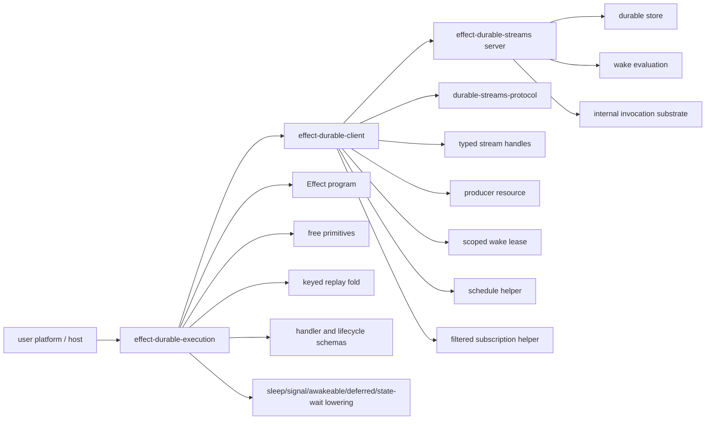

# Effect durable execution SDD

Status: draft
Target repo: `gurdasnijor/fluent-firegrid`
Protocol source of truth: `PROTOCOL.md`
Feature spec reference: `docs/reference/durable-streams/features/durable-streams/effect-execution.feature.yaml`
Companion client SDD: `docs/sdds/effect-durable-client-sdd.md`
Companion server SDD: `docs/sdds/effect-durable-streams-server-v2-sdd.md`
Upstream reference package: `docs/reference/durable-streams/packages/effect-durable-execution`
Local design reference: `packages/fluent-firegrid`
Source snapshot: `docs/reference/durable-streams/docs/sdds/effect-durable-execution-sdd.md`

This SDD was promoted from the Durable Streams reference snapshot so the client,
execution, and server designs are visible together in this repository. Some
package names and historical notes remain upstream-oriented until the execution
design is revised against local code context.

## Purpose

This SDD defines the target shape for `packages/effect-durable-execution`: a
thin Effect-native authoring layer for users building their own durable
execution platform on top of Durable Streams.

The package is not a hosted platform and should not expose "workflow" as the
canonical user vocabulary. Its public surface is operation-first:

- `Effect.gen` builds lazy durable programs;
- free primitives such as `run`, `sleep`, `signal`, `awakeable`, `deferred`,
  `attach`, `state`, `channel`, and `select` are resolved from the active
  operation runtime;
- named handler declarations add stable identity and Effect Schema metadata; and
- host packages register those handlers and provide the runtime Layer.

The current `packages/effect-durable-execution` and
`/Users/gnijor/gurdasnijor/fluent-firegrid/packages/fluent-firegrid` are design
references, not compatibility targets. The package should preserve useful
ideas, especially `run(...)` ergonomics, while replacing the old Durable Streams
binding with the new `effect-durable-client` and server substrate.

This covers `effect-execution.PACKAGE.1` through
`effect-execution.PACKAGE.4`, `effect-execution.BOUNDARY.1` through
`effect-execution.BOUNDARY.5`, and `effect-execution.SCOPE.1` through
`effect-execution.SCOPE.4`.

## Vocabulary

The public vocabulary is deliberately smaller than Restate or Cloudflare
Workflows:

| Public term | Internal/substrate term | Meaning                                          |
| ----------- | ----------------------- | ------------------------------------------------ |
| operation   | activation body         | Lazy durable computation built with `Effect.gen` |
| handler     | target                  | Named ingress surface with input/output schemas  |
| step        | operation log record    | Named `run` result or failure                    |
| signal      | signal/inbox cursor     | Durable park until matching external fact        |
| deferred    | durable promise         | Invocation/key-scoped settle-once value          |
| awakeable   | external signal handle  | One-shot value resolved by an external caller    |
| state wait  | filtered subscription   | Durable park until a materialized state fact     |

`invocation` remains a substrate term for the server/client/protocol state
machine. Application hosts may project invocations into their own "session" or
"run" concepts, but `effect-durable-execution` should not mint `Session*`
durable facts.

## Layer boundary



The rule is:

- server owns durable substrate state machines;
- client owns protocol semantics as Effect primitives;
- execution owns operation authoring, replay folds, schemas, and lowering rules;
  and
- the user platform owns routing, tenancy, deployment, worker pools, and
  supervision.

The execution package defines the ordering contract that makes activations safe.
It does not own the worker loop that claims wakes or hosts HTTP routes.

## State machine layer decision

The current draft is too loose if it implies durable execution appears by
writing enough log records. The real mechanism is an invocation state machine:
durable operation-log events are inputs, state transitions are deterministic,
and any required substrate calls are emitted as commands for a driver to
interpret.

The layer split should be:

- `effect-durable-execution` defines `InvocationMachine`, `InvocationState`,
  `InvocationEvent`, `InvocationCommand`, replay helpers, and transition tests.
  This is the durable execution semantics layer.
- the host/runtime package drives the machine: claim wake, claim producer epoch,
  read the invocation log, replay events through the machine, run missing user
  work, interpret emitted commands, append resulting facts, and ack the wake
  last. This is the worker orchestration layer.
- `effect-durable-client` remains a protocol client. It provides producers,
  reads, schedules, subscriptions, claims, acks, and leases, but it does not own
  invocation lifecycle.
- `effect-durable-streams` remains the substrate. It stores streams and wakes;
  it must not know about `run`, `sleep`, `signal`, or invocation statecharts.

This mirrors the event-sourced workflow pattern: replay rebuilds state, a
decision function chooses outputs, and tests can exercise the transition model
without running infrastructure. It also matches the useful part of Restate's
worker design: journal entries are not passive logs; they drive a lifecycle
state machine that may write state, complete promises, forward completions,
handle timers, terminate, purge, or resume an invocation.

Implementation should use `@effect/experimental/Machine` for the in-process
activation machine. The implementation work must add `@effect/experimental` as
an explicit dependency of `packages/effect-durable-execution` before importing
it. The SDD should treat the package as a chosen abstraction, not as an
incidental transitive dependency.

## Invocation statechart

The invocation lifecycle should be modeled as a statechart, not a flat bag of
booleans. Statecharts are useful here because the invocation has a top-level
lifecycle plus nested waiting/running modes.

Proposed durable states:

| State                 | Meaning                                                       |
| --------------------- | ------------------------------------------------------------- |
| `NotStarted`          | No `InvocationStarted` fact has been replayed                 |
| `Activating`          | Wake claimed, writer claimed, log replay in progress          |
| `Running`             | Handler is evaluating and may execute durable primitives      |
| `Suspending`          | Handler reached a durable wait and is appending wait intent   |
| `Suspended.Timer`     | Waiting for a scheduled timer fact                            |
| `Suspended.Signal`    | Waiting for a signal fact                                     |
| `Suspended.State`     | Waiting for a state/subscription match                        |
| `Suspended.Deferred`  | Waiting for a deferred/awakeable settlement                   |
| `Suspended.Child`     | Waiting for child invocation completion                       |
| `Completing`          | Handler returned and terminal success is being appended       |
| `Completed`           | Terminal success fact exists                                  |
| `Failing`             | Handler failed and terminal failure is being appended         |
| `Failed`              | Terminal failure fact exists                                  |
| `Cancelling`          | Cancellation requested and cancellation outcome is appending  |
| `Cancelled`           | Terminal cancellation fact exists                             |

`StaleWriter` is not a durable invocation state. It is an activation-local
result: a stale executor may continue local work, but the producer epoch must
reject its append. The driver should stop interpreting commands after a stale
writer error and should not ack the wake as successful.

Machine events should include both durable facts and activation facts:

```ts
export type InvocationEvent =
  | { readonly _tag: "ActivationClaimed"; readonly wake: InvocationWake }
  | { readonly _tag: "WriterClaimed"; readonly producer: FencedProducerInfo }
  | { readonly _tag: "ReplayStarted" }
  | { readonly _tag: "ReplayFinished"; readonly tailOffset: Offset }
  | OperationLogEvent
  | { readonly _tag: "ProgramReturned"; readonly value: unknown }
  | { readonly _tag: "ProgramFailed"; readonly error: unknown }
  | { readonly _tag: "ProducerFenced" }
  | { readonly _tag: "WakeAcked" }
  | { readonly _tag: "ActivationCrashed"; readonly defect: unknown }
```

Machine commands should be data, not performed inside transitions:

```ts
export type InvocationCommand =
  | { readonly _tag: "ClaimWriter"; readonly producerId: string }
  | { readonly _tag: "ReadLogToTail" }
  | { readonly _tag: "Append"; readonly event: OperationLogEvent }
  | { readonly _tag: "RunStep"; readonly key: string }
  | { readonly _tag: "CreateSchedule"; readonly request: ScheduleRequest }
  | { readonly _tag: "CreateSubscription"; readonly request: SubscriptionRequest }
  | { readonly _tag: "AckWake"; readonly wake: InvocationWake }
  | { readonly _tag: "ReleaseWake"; readonly wake: InvocationWake }
  | { readonly _tag: "StopActivation"; readonly reason: StopReason }
```

The invariant is: every substrate mutation happens because the command
interpreter handled an `InvocationCommand`, and every command either appends a
durable fact or produces a new `InvocationEvent` that the machine consumes. No
hidden side effect should update invocation semantics outside the machine.

The activation driver has one job:

```ts
export const activateInvocation = (input: ActivationInput) =>
  Effect.scoped(
    Effect.gen(function* () {
      const actor = yield* Machine.boot(InvocationMachine, input)

      yield* actor.send(new ActivationClaimed(input.wake))
      yield* drainCommands(actor, CommandInterpreter.Live)

      return yield* actor.get
    })
  )
```

Actual code will use typed `Schema.TaggedRequest` requests for Machine messages
so `actor.send(...)` returns typed replies where useful. The important part is
that activation sends events into the machine; it does not manually mutate an
ad-hoc runtime object.

## Package shape

Proposed package path:

```text
packages/effect-durable-execution
```

Proposed modules:

```text
src/index.ts
src/operation.ts
src/free.ts
src/runtime.ts
src/run.ts
src/operation-log.ts
src/replay.ts
src/invocation-event.ts
src/invocation-state.ts
src/invocation-command.ts
src/invocation-machine.ts
src/machine-driver.ts
src/command-interpreter.ts
src/operation-log-layer.ts
src/handler.ts
src/client.ts
src/invocation-reference.ts
src/metadata.ts
src/primitives/sleep.ts
src/primitives/deferred.ts
src/primitives/awakeable.ts
src/primitives/signal.ts
src/primitives/state.ts
src/primitives/wait-for-state.ts
src/primitives/select.ts
src/error.ts
src/schema.ts
```

Module ownership:

- `operation.ts` defines durable program type aliases and internal scheduler
  nodes. It does not expose a public `Operation` interface.
- `free.ts` exposes free primitives that delegate to the active operation
  runtime.
- `runtime.ts` owns the active-operation slot and scheduler interface.
- `run.ts` defines durable step options and step execution semantics.
- `operation-log.ts` defines the append/read abstraction used by the runtime.
- `replay.ts` owns pure replay helpers that feed operation-log events into the
  invocation machine.
- `invocation-event.ts` defines durable and activation-local machine inputs.
- `invocation-state.ts` defines the top-level lifecycle statechart.
- `invocation-command.ts` defines command outputs for the driver to interpret.
- `invocation-machine.ts` defines the `@effect/experimental/Machine`
  transition model.
- `machine-driver.ts` boots the machine for an activation, feeds replayed facts
  into it, and drains commands until quiescence or terminal state.
- `command-interpreter.ts` maps machine commands to `effect-durable-client`
  calls and appends.
- `operation-log-layer.ts` adapts operation-log reads and appends to
  `effect-durable-client`.
- `handler.ts` defines named handler declarations with Effect Schema metadata.
- `client.ts` derives call/send clients over injected ingress.
- `invocation-reference.ts` wraps invocation references returned by call/send
  primitives and exposes attach, signal, and cancel operations against those
  references where the substrate supports them.
- `metadata.ts` defines invocation and step metadata events.
- `primitives/*` lower authoring primitives to client/server substrate
  capabilities.

Restate-style `service`, `object`, and `workflow` definition APIs are not part
of this package. Hosts may group handlers into those or other platform concepts,
but `effect-durable-execution` exports `handler(...)` as its only definition
primitive. `workflow` vocabulary is not canonical and should not appear in
first-party examples.

This covers `effect-execution.API.3`, `effect-execution.API.6` through
`effect-execution.API.10`, `effect-execution.API.24`, and
`effect-execution.USERLAND.1` through `effect-execution.USERLAND.4`.

## Effect-native program model

Public durable programs are ordinary Effect values. The package should not expose
a second public generator protocol that duplicates `Effect.Effect`:

```ts
import { Effect } from "effect"

export type DurableProgram<A, E = never, R = never> = Effect.Effect<
  A,
  E,
  R | DurableExecutionRuntime
>
```

The load-bearing properties are:

- durable programs keep Effect's normal `A`, `E`, and `R` type parameters;
- durable requirements are supplied through Effect services and Layers;
- user code composes with `Effect.gen`, `yield*`, pipes, scopes, fibers, and
  ordinary Effect combinators;
- every activation re-runs a lazy Effect program after replaying the durable
  operation log; and
- any primitive scheduler nodes are internal implementation details, not public
  values users yield.

Example:

```ts
import { Duration, Effect, Schema } from "effect"
import { run, signal, sleep } from "effect-durable-execution"

const Approval = Schema.Struct({
  approved: Schema.Boolean,
  reason: Schema.String,
})

export const reviewRequest = Effect.gen(function* () {
  const request = yield* handlerRequest(PermissionRequest)

  const draft = yield* run("draft", draftResponse(request), {
    output: DraftResponse,
    retry: {
      maxAttempts: 3,
      initialInterval: Duration.millis(100),
    },
  })

  const approval = yield* signal("approval", Approval)

  yield* sleep("cooldown", Duration.minutes(5))

  return yield* run("send", sendResponse(draft, approval), {
    output: ApprovalResult,
  })
})
```

Handler declarations provide the decoded request through `handlerRequest(...)`.
The underlying program remains an `Effect.Effect`, not a custom `Operation`.

This covers `effect-execution.API.6`, `effect-execution.API.20`,
`effect-execution.CONFORMANCE.10`, and `effect-execution.CONFORMANCE.11`.

## User-facing code examples

The public API should be explainable from user code first. The examples below
are the target authoring surface; the state machine and command interpreter
exist to make this code durable without exposing runtime plumbing.

Define schemas and a handler:

```ts
import { Duration, Effect, Schema } from "effect"
import {
  handler,
  handlerRequest,
  run,
  signal,
  sleep,
} from "effect-durable-execution"

const PermissionRequest = Schema.Struct({
  requestId: Schema.String,
  userId: Schema.String,
  resource: Schema.String,
})

const DraftResponse = Schema.Struct({
  message: Schema.String,
})

const Approval = Schema.Struct({
  approved: Schema.Boolean,
  reason: Schema.String,
})

const ApprovalResult = Schema.Struct({
  requestId: Schema.String,
  approved: Schema.Boolean,
  sentAt: Schema.DateTimeUtc,
})

export const reviewPermission = handler("reviewPermission", {
  input: PermissionRequest,
  output: ApprovalResult,
})(
  Effect.gen(function* () {
    const request = yield* handlerRequest(PermissionRequest)

    const draft = yield* run("draft-response", draftResponse(request), {
      output: DraftResponse,
      retry: {
        maxAttempts: 3,
        initialInterval: Duration.millis(100),
        maxInterval: Duration.seconds(5),
      },
    })

    yield* run("notify-reviewer", notifyReviewer(request, draft), {
      output: Schema.Void,
      idempotencyKey: `notify-reviewer:${request.requestId}`,
    })

    const approval = yield* signal("approval", Approval)

    yield* sleep("audit-delay", Duration.seconds(10))

    return yield* run("send-result", sendApprovalResult(request, approval), {
      output: ApprovalResult,
      idempotencyKey: `send-result:${request.requestId}`,
    })
  })
)
```

The handler body is normal `Effect.gen`. Users do not receive an `ops` object,
do not call a public `currentRuntime`, and do not manually append operation-log
events. `run`, `signal`, and `sleep` talk to the active durable runtime
internally.

Register handlers in a host:

```ts
import { Layer } from "effect"
import { serve } from "fluent-runtime"
import { DurableExecutionRuntime } from "effect-durable-execution"
import { DurableStreamClientLive } from "effect-durable-client-node"
import { reviewPermission } from "./handlers/review-permission.js"

serve({
  handlers: [reviewPermission],
  layer: DurableExecutionRuntime.layer.pipe(
    Layer.provide(DurableStreamClientLive)
  ),
})
```

The exact `serve(...)` package belongs to the host/runtime layer, not
`effect-durable-execution`. The execution package only defines handler metadata
and the runtime Layer needed by handler evaluation.

Call a handler from application code:

```ts
import { Effect } from "effect"
import { client } from "effect-durable-execution"
import { reviewPermission } from "./handlers/review-permission.js"

const program = Effect.gen(function* () {
  const durable = yield* client({ handlers: [reviewPermission] })

  const invocation = yield* durable.reviewPermission.send({
    requestId: "req-123",
    userId: "user-42",
    resource: "billing-dashboard",
  })

  yield* invocation.signal("approval", Approval).resolve({
    approved: true,
    reason: "manager approved",
  })

  return yield* invocation.attach
})
```

`send` returns an invocation reference because the caller wants to signal and
attach later. A request/response helper may also exist:

```ts
const result = yield* durable.reviewPermission.call({
  requestId: "req-124",
  userId: "user-43",
  resource: "reports",
})
```

Access durable state from ordinary Effect Schemas:

```ts
import {
  handler,
  handlerRequest,
  run,
  state,
} from "effect-durable-execution"

const Account = Schema.Struct({
  id: Schema.String,
  status: Schema.Literal("ready"),
}).annotations({
  identifier: "account",
})

export const provisionAccount = handler("provisionAccount", {
  input: ProvisionAccountRequest,
  output: ProvisionAccountResult,
})(
  Effect.gen(function* () {
    const request = yield* handlerRequest(ProvisionAccountRequest)
    const accounts = yield* state(Account)

    yield* run("create-provider-account", createProviderAccount(request), {
      output: ProviderAccount,
      idempotencyKey: `provider-account:${request.accountId}`,
    })

    const account = yield* accounts.wait({
      key: request.accountId,
      where: { status: "ready" },
    })

    return { accountId: account.id, ready: true }
  })
)
```

`state(schema, options?)` accepts an Effect Schema directly. Internally the
execution package adapts it with `Schema.standardSchemaV1(schema)` for the
underlying `@durable-streams/state` collection helper path. The durable state
event type comes from the schema identifier by default and the primary key is
inferred from an `id` field by default. A non-`id` primary key can be supplied as
the small bit of protocol metadata the state package needs. Users do not author
a second schema DSL and do not manually construct state protocol events in
operation code.

The returned state binding is reusable outside handler code too. It should carry
the schema, event type, primary key, and derived tool/client metadata needed by
runtime edges:

```ts
const accounts = state(Account)

// operation/runtime usage
yield* accounts.get("acct_1")
yield* accounts.set({ id: "acct_1", status: "ready" })
yield* accounts.wait("acct_1", { where: { status: "ready" } })

// client/UI usage
accounts.changes({ where: { id: "acct_1" } })
accounts.subscribe("acct_1")
accounts.query({ where: { status: "ready" } })
```

`get`, `set`, `delete`, `upsert`, and `wait` are Effect operations inside an
active runtime. `changes`, `subscribe`, and `query` are client/runtime-edge
accessors over the same schema binding. The binding is the typed handle; the
runtime chooses whether a particular accessor is legal in the current context.

Read state from another handler:

```ts
export const getAccount = handler("getAccount", {
  input: GetAccountRequest,
  output: Schema.NullOr(Account),
})(
  Effect.gen(function* () {
    const request = yield* handlerRequest(GetAccountRequest)
    const accounts = yield* state(Account)
    return yield* accounts.get(request.accountId)
  })
)
```

Use local Effect composition for non-durable concurrency:

```ts
const [profile, settings] = yield* Effect.all([
  run("load-profile", loadProfile(userId), { output: Profile }),
  run("load-settings", loadSettings(userId), { output: Settings }),
])
```

Each `run` remains independently keyed and replayable. Plain `Effect.all`,
`Effect.race`, scoped fibers, and other Effect combinators do not create hidden
positional durable counters.

## Free primitives

Free primitives are the public authoring surface. Each primitive is a function
returning an `Effect.Effect` or a handle whose operations return Effects:

```ts
export const run: Run
export const sleep: Sleep
export const awakeable: Awakeable
export const deferred: Deferred // vocabulary alias over the substrate primitive
export const signal: Signal
export const attach: Attach
export const call: Call
export const send: Send
export const client: ClientFactory
export const sendClient: SendClientFactory
export const cancel: Cancel
export const state: State
export const channel: Channel
export const select: Select
export const handlerRequest: HandlerRequest
```

They must not require an explicit `DurableExecution` object or an `ops`
parameter. Internally they resolve the active operation runtime from an
Effect/runtime-local slot and delegate to it. Calling a free primitive outside an
active operation runtime fails deterministically.

The active-runtime lookup is internal. The package must not export a public
`currentRuntime`, `currentOps`, or equivalent escape hatch.

Compared with Restate's free-standing API, the useful pattern is the
slot-backed delegation style, not the exact surface. The target split is:

| Restate free category  | Effect durable execution decision                                |
| ---------------------- | ---------------------------------------------------------------- |
| `currentOps()`         | internal only                                                    |
| `handlerRequest()`     | expose, schema decoded                                           |
| `run`, `sleep`         | expose as durable Effect primitives                              |
| `signal`, `awakeable`  | expose with Effect Schema boundaries                             |
| `workflowPromise`      | expose as `deferred` vocabulary                                  |
| `attach`, `cancel`     | expose only against explicit invocation references/ids           |
| `client`, `sendClient` | expose for active-operation call/send composition                |
| `resolveAwakeable`     | host/ingress client API, not handler free primitive              |
| `rand`, `date`         | do not copy; use keyed `run` or future replay-safe primitives    |
| `logger`               | use Effect logging services                                      |
| `all`, `race`, `any`   | use Effect built-ins for ordinary local composition              |
| `select`               | optional typed helper for tagged durable/local waits             |
| `spawn`                | use Effect scoped fibers; durable children are a separate helper |
| `channel`              | expose local-only settle-once coordination                       |
| `state(schema)`        | bind an Effect Schema to durable state collection access         |

These are the Restate `RestateOperations` tier: operation-body primitives backed
by the active context and scheduler. They are not host/control-plane APIs.
Specifically, this package must not introduce `start`, `status`, `list`,
`delete`, `pause`, `resume`, or `restart` invocation-control helpers.

`attach`, `cancel`, and cross-session signal helpers target an explicit
invocation reference or id inside an active operation runtime. They are not
methods on a public lifecycle control handle. `call` and `send` may return
invocation references when the substrate exposes them; those references are
small handles for operation composition, not tracking records.

`signal(name, schema)` is receiver-side: it waits for a named signal on the
current active operation and returns `Effect.Effect<A, SignalError, R>`. It does
not send anything.
`InvocationReference.signal(name, schema)` is sender-side: it returns a
synchronous `SignalReference<A>` with `resolve(value)` and `reject(reason)`.

`awakeable(schema)` creates a fresh externally resolvable one-shot handle whose
identifier can be handed to a caller outside the current operation. Durable
promises are different: they are named, invocation/key-scoped settle-once values
that can be peeked, awaited, resolved, or rejected by name inside the same keyed
execution context.

`state(schema, options?)` accepts an Effect Schema and returns an active-runtime
collection handle. Internally it adapts the schema with
`Schema.standardSchemaV1(...)` and delegates validation and change-event helper
construction to `@durable-streams/state`'s collection helper pattern. The state
protocol event `type` comes from the schema identifier by default. The
`primaryKey` is inferred from an `id` field where possible or supplied in
`options`.

State waits are collection methods, not a separate free primitive.
`accounts.wait(...)` waits for a schema-bound collection change to
satisfy a server-side filter, then materializes and decodes the matching state
through the same Effect Schema. A future `waitForEvent` helper may wrap
source-specific waits, but the first durable surface should preserve the
distinct identity and completion semantics of `sleep`, `signal`, `awakeable`,
`deferred`, bound state waits, and local `channel`.

Ingress clients are a separate host/client-facing surface. They can call/send
handlers, resolve/reject awakeables, and fetch attached results over transport.
They are not read from the active operation runtime and are not part of this
package's free primitive surface.

Ordinary Effect composition is preferred for local concurrency:
`Effect.all`, `Effect.race`, `Effect.raceAll`, `Effect.forkScoped`, and scoped
fibers. A package-local `select` helper may exist for tagged waits over durable
handles, but it must not imply durable child invocation behavior. Local `spawn`
is only a thin Effect fiber/routine helper unless explicitly lowered to durable
child invocation primitives.

This covers `effect-execution.API.5`, `effect-execution.API.7`, and
`effect-execution.API.12` through `effect-execution.API.27`.

## Signals, awakeables, and durable promises

These are three different settle-once patterns:

| Primitive                | Identity            | Who waits                       | Who completes                        | Scope                        |
| ------------------------ | ------------------- | ------------------------------- | ------------------------------------ | ---------------------------- |
| `signal(name, schema)`   | stable signal name  | current operation               | another invocation or ingress sender | current invocation           |
| `awakeable(schema)`      | generated opaque id | current operation               | external ingress client using the id | one operation-created handle |
| `deferred(name, schema)` | stable durable name | current operation/keyed context | current operation/keyed context      | named invocation/key scope   |

Receiver-side signal:

```ts
const approval = yield * signal("approval", Approval)
```

Sender-side signal:

```ts
const ref = yield * send(reviewRequest, input)
yield * ref.signal("approval", Approval).resolve({ approved: true })
```

Awakeable:

```ts
const approval = yield * awakeable(Approval)
yield *
  run("notify-human", () =>
    sendEmail({ approveUrl: `/approve/${approval.id}` })
  )
const value = yield * approval.promise
```

Durable deferred:

```ts
const done = deferred("done", Result)
yield * done.resolve(result)
const value = yield * done.get()
```

The distinction is load-bearing:

- signals model named notifications to an invocation;
- awakeables model externally completed opaque handles;
- durable deferreds model named invocation/key-scoped promises; and
- none of these should be implemented as a client-side polling loop.

## Bound state and webhook-originated facts

Bound state is not another name for `signal`. Collection waits park on durable
domain facts represented through `@durable-streams/state` change events and
server-side filtered subscriptions:

```ts
import { Duration, Effect } from "effect"
import { CEL } from "effect-durable-client/CEL"
import { state } from "effect-durable-execution"

const approvals = yield* state(Approval, {
  primaryKey: "approvalId",
})
const approval =
  yield *
  approvals.wait({
    key: request.approvalId,
    filter: CEL.and(
      CEL.eq(CEL.path("value", "approvalId"), request.approvalId),
      CEL.eq(CEL.path("value", "status"), "approved")
    ),
    schema: Approval,
    timeout: Duration.days(7),
  })
```

The collection handle owns the user-facing wait shape and Schema decode. It
lowers to:

1. record `StateWaitRegistered` in the operation log;
2. create or use a filtered Durable Streams subscription over the relevant state
   or event stream;
3. suspend the invocation with a current wait reason;
4. wake after the server evaluates the filter against durably appended facts;
5. re-read and materialize the matching state; and
6. record `StateWaitSatisfied` before returning the decoded value.

Webhook signaling uses the same path. A webhook handler is host-owned ingress:

```ts
const stripeWebhook = Effect.gen(function* () {
  const event = yield* verifyStripeWebhook(StripeEvent)
  const client = yield* DurableStreamClient
  const payments = client.stream("state/payments", Payment)
  const producer = yield* payments.producer("stripe-webhook")

  yield* producer.append({
    id: event.paymentId,
    status: "captured",
    stripeEventId: event.id,
  })
})
```

The webhook does not directly resume an invocation. It verifies, decodes, and
appends a durable event or state fact. After the append commits, the server's
filtered wake path can wake matching invocations, and replay/materialization
decides whether `accounts.wait(...)` can return. If a product needs an opaque task
token instead, the webhook can resolve an awakeable through ingress client APIs;
that remains distinct from state/resource waits.

The Electric Agents runtime is useful design inspiration for the host layer:
external event sources can be reified as manifest-backed observation sources
whose payloads land in typed `@durable-streams/state` collections such as
`webhook_event`. A host can then expose tools like "list sources", "subscribe to
source", and "unsubscribe" that write subscription/manifest facts for agents to
use. That pattern belongs above the Durable Streams server and above the
handler-facing execution primitive. In this package, the durable operation still
waits through a bound state collection such as `accounts.wait(...)`; the host
decides whether a provider webhook, database feed, cron source, or agent tool
created the underlying state stream and subscription.

## Agent tool binding for state waits

The MCP host remains a tool edge. It should expose state waits as Firegrid
choreography tools backed by the same bound state handles, not as a separate
state runtime.

```text
Claude ACP      Codex ACP      cloud agent      stdio/HTTP agent
    │              │              │                  │
    ▼              ▼              ▼                  ▼
adapter A      adapter B      adapter C          adapter D
    │              │              │                  │
    └──────────────┴──────────────┴──────────────────┘
                           │
                           ▼
                Firegrid choreography tools
          wait_for · sleep · spawn · spawn_all · schedule_me · execute
                           │
                           ▼
                 same Durable Streams session model
              L1 harness facts + L2 coordination facts
                           │
                           ▼
             projections for humans, agents, firelab, audit
```

For an Effect Schema binding:

```ts
const Account = Schema.Struct({
  id: Schema.String,
  status: Schema.Literal("pending", "ready"),
}).annotations({ identifier: "account" })

const accounts = state(Account)
```

the MCP host can expose either a generic `wait_for` tool whose `target` names the
state binding, or a generated specialized tool such as `wait_for_account`. Both
forms lower to the same runtime service:

```ts
tool("wait_for_account", {
  input: Schema.Struct({
    id: Schema.String,
    where: Schema.Struct({
      status: Schema.optional(Schema.Literal("pending", "ready")),
    }),
    timeoutMs: Schema.optional(Schema.Number),
  }),
})(Effect.gen(function* () {
  const args = yield* toolRequest
  return yield* accounts.wait(args.id, {
    where: args.where,
    timeout: args.timeoutMs,
  })
}))
```

This is a tool binding, not tool-owned durability. The flow is:

```text
harness tool call: wait_for_account
  │
  ▼
harness I/O boundary records L1 tool_call
  │
  ▼
Firegrid MCP host
  schema + auth + tool dispatch only
  │
  ▼
fluent-runtime tool service
  append L2 wait intent on session stream
  create or reuse filtered state subscription
  park harness turn
  │
  ▼
Durable Streams wake
  provider/user/source appends Account state fact
  subscription matches
  fluent-runtime claims wake
  materializes matching Account
  appends L2 wait_matched + tool_result facts
  │
  ▼
harness I/O boundary returns native tool_result
```

The same schema binding supplies:

- handler-side `accounts.get/set/upsert/delete/wait`;
- client/UI `accounts.changes/subscribe/query`;
- MCP tool input and output schemas derived from Effect Schema; and
- projection metadata for humans, agents, Firelab, and audit.

This preserves the Firegrid architecture: adapters differ by harness, the MCP
host is an edge, fluent-runtime owns wait matching and session facts, Durable
Streams remains the single durable boundary, and projections read the same L1/L2
facts. Agent tools do not subscribe directly to Durable Streams; they call a
tool that records intent, parks, and returns after the runtime commits the
matched state fact and tool result.

This covers `effect-execution.API.25` through
`effect-execution.API.27` and `effect-execution.RESUME.6` through
`effect-execution.RESUME.7`.

## Channels

`channel` is different from signal, awakeable, and durable deferred. It is a
local in-memory settle-once coordination primitive between routines inside one
active operation:

```ts
const approval = yield * channel<Approval>()

yield *
  Effect.forkScoped(
    run("notify-human", () => sendEmail({ approveUrl })).pipe(
      Effect.zipRight(approval.send({ approved: true }))
    )
  )

const value = yield * approval.receive
```

Channel semantics:

- first send wins;
- receive resolves once;
- the handle is not externally addressable;
- no operation-log event is appended for channel send/receive; and
- replay does not reconstruct completed channel state.

Use `signal` for named durable notifications to an invocation, `awakeable` for
externally completed opaque handles, and `deferred` for named invocation-scoped
durable promises. A channel is only local Effect coordination.

This covers `effect-execution.API.21` and
`effect-execution.CONFORMANCE.23`.

## Handler declarations

Top-level service, object, or workflow containers are not part of this package's
authoring surface. Stable handler identity and schemas are still required for
hosts, routing, generated clients, and manifests.

Canonical declaration:

```ts
import { Effect, Schema } from "effect"
import { handler, handlerRequest, run, signal } from "effect-durable-execution"

export const reviewRequest = handler("reviewRequest", {
  input: PermissionRequest,
  output: ApprovalResult,
})(
  Effect.gen(function* () {
    const request = yield* handlerRequest(PermissionRequest)

    const draft = yield* run("draft", draftResponse(request), {
      output: DraftResponse,
    })
    const approval = yield* signal("approval", Approval)
    return { draft, approval }
  })
)
```

Host registration:

```ts
serve({
  handlers: [reviewRequest],
  layer: ExecutionRuntime.layer(...),
})
```

Hosts may group handlers into services, virtual objects, workflows, agents, or
other platform concepts, but those adapters live above
`effect-durable-execution`. This package exports `handler(...)` as the only
definition primitive.

This covers `effect-execution.API.8`, deprecated `effect-execution.API.9`,
`effect-execution.API.24`, `effect-execution.CONFORMANCE.5`,
`effect-execution.CONFORMANCE.14`, and `effect-execution.CONFORMANCE.25`.

## Effect Schema boundary

The package must not expose a Restate-style `serde` abstraction. Effect Schema is
the only public serialization and validation boundary.

`Schema.Schema<A, I, R>` already carries:

- runtime type `A`;
- encoded wire/storage type `I`;
- required context `R`;
- `Schema.encode` / `Schema.encodeUnknown`;
- `Schema.decode` / `Schema.decodeUnknown`;
- transformations such as `Schema.parseJson(...)`;
- binary encodings such as `Schema.Uint8ArrayFromBase64` and
  `Schema.Uint8ArrayFromSelf`; and
- typed errors through `Schema.TaggedError`.

Every public value boundary should accept schemas:

```ts
const checkout = Effect.gen(function* () {
  const req = yield* handlerRequest(CheckoutRequest)

  yield* run("charge-card", chargeCard(req), {
    output: ChargeResult,
    error: PaymentFailed,
  })

  const approval = yield* signal("approval", Approval)

  const done = yield* deferred("done", Approval)
  yield* done.resolve(approval)
})
```

Public durable execution boundaries accept discharged schemas only:

```ts
Schema.Schema<A, I, never>
```

Schemas may use services while user code constructs them, but replay, durable
decode, durable encode, signal materialization, deferred resolution, and state
wait materialization cannot require live services. Storage persists encoded
values, not runtime values. Transport codecs are an internal adapter selected by
content type and encoded shape. Custom serialization is expressed as Schema
transformations.

This covers `effect-execution.API.10`, `effect-execution.CONFORMANCE.13`, and
the replacement for deprecated `effect-execution.USERLAND.3`, plus
`effect-execution.SCHEMA.1`.

## `run` and retry policy

`run` is the durable step primitive:

```ts
export interface RunOptions<A, E, EncodedA = unknown, EncodedE = unknown> {
  readonly output?: Schema.Schema<A, EncodedA, never>
  readonly error?: Schema.Schema<E, EncodedE, never>
  readonly retry?: RetryPolicy
  readonly idempotencyKey?: string
  readonly cancellation?: CancellationPolicy
}

export interface Run {
  <A, E, R, EncodedA = unknown, EncodedE = unknown>(
    key: string,
    action: Effect.Effect<A, E, R> | RunAction<A, E, R>,
    options?: RunOptions<A, E, EncodedA, EncodedE>
  ): Effect.Effect<A, E | DurableExecutionError, R | DurableExecutionRuntime>
}
```

Retry is a policy on `run`, not a separate primitive:

```ts
const fetchOp = (url: string) =>
  Effect.gen(function* () {
    return yield* run("fetch", ({ signal }) => fetchJson(url, { signal }), {
      output: FetchResult,
      retry: {
        maxAttempts: 5,
        initialInterval: Duration.millis(100),
        maxInterval: Duration.seconds(10),
        intervalFactor: 2,
      },
    })
  })
```

The retry policy controls re-execution before the step outcome is durably
recorded. Once a `StepSucceeded` or typed `StepFailed` fact exists, replay
returns the recorded outcome and does not retry the action.

Cancellation is also routed through `run`: actions receive an `AbortSignal`
where applicable, and if the signal aborts during the action, the wrapper
records the canonical cancellation outcome instead of an incidental abort error.

This covers `effect-execution.API.1`, `effect-execution.API.11`, and
`effect-execution.CONFORMANCE.12`.

## Operation log and replay folds

The package should avoid using "journal" as a generic catch-all. The operation
log is the event stream that drives the invocation machine. Replay is not a
separate implementation path; replay is just sending previously committed
`OperationLogEvent` values into `InvocationMachine` in offset order.

There are two read models derived from that same machine-driven replay:

- `StepReplayFold` answers `run(key, action)`: should this action be skipped,
  returned, failed, or evaluated?
- `InvocationReplayState` is the current machine state after replay:
  lifecycle, suspended waits, signals, deferred values, timers, cancellation,
  child invocation state, and materialized user state.

The operation log itself is an abstraction supplied to the runtime:

```ts
export interface OperationLog {
  readonly readToTail: Effect.Effect<
    ReadonlyArray<OperationLogEvent>,
    ExecutionError
  >
  readonly append: (
    event: OperationLogEvent
  ) => Effect.Effect<void, ExecutionError>
  readonly streamPath: string
}
```

`StepReplayFold` consumes only terminal step outcome events for replay
decisions:

```ts
export type StepOutcomeEvent = StepSucceeded | StepFailed
```

It:

1. reads terminal step outcome events by `stepKey`;
2. finds the latest event for the requested step key;
3. returns a recorded success without evaluating the action;
4. replays a recorded failure through the declared error schema; and
5. runs and records the action only when no step fact exists.

`StepStarted`, `StepAttempted`, and timing metadata are observability facts. They
must not cause replay to skip an action. If a process crashes after
`StepStarted` and before `StepSucceeded` / `StepFailed`, the step is eligible to
run again.

`InvocationMachine` consumes the broader operation-log event set:

```ts
export type OperationLogEvent =
  | InvocationStarted
  | InvocationSuspended
  | InvocationCompleted
  | InvocationFailed
  | InvocationCancelled
  | StepStarted
  | StepSucceeded
  | StepFailed
  | SleepScheduled
  | SleepFired
  | SignalWaitRegistered
  | SignalReceived
  | StateWaitRegistered
  | StateWaitSatisfied
  | DeferredCreated
  | DeferredResolved
  | DeferredRejected
  | ChildStarted
  | ChildCompleted
  | ChildFailed
  | StateSet
  | StateDeleted
```

Replay transition effects:

| Event                                      | Runtime effect                                    |
| ------------------------------------------ | ------------------------------------------------- |
| `StepSucceeded(key, value)`                | `run(key, ...)` returns the recorded value        |
| `StepFailed(key, error)`                   | `run(key, ...)` fails through the declared schema |
| `StepStarted`                              | observability only; does not skip action          |
| `SleepScheduled`                           | reconstructs a suspended timer wait               |
| `SleepFired`                               | satisfies the matching timer wait                 |
| `SignalWaitRegistered`                     | reconstructs a named signal wait                  |
| `SignalReceived`                           | satisfies matching `signal(...)` calls            |
| `StateWaitRegistered`                      | reconstructs a state/resource wait                |
| `StateWaitSatisfied`                       | records the materialized matching state fact      |
| `DeferredResolved` / `DeferredRejected`    | satisfies matching `deferred(...).get()`          |
| `InvocationCompleted` / `InvocationFailed` | terminal invocation state                         |
| `InvocationCancelled`                      | injects cancellation/interruption                 |
| `StateSet` / `StateDeleted`                | reconstructs invocation-local materialized state  |

Replay must be total over known committed facts. Unknown event tags from a newer
runtime are a compatibility error unless the event schema declares them
ignorable. A replay decode failure must prevent handler evaluation; otherwise a
worker could run from a state it did not understand.

This covers `effect-execution.JOURNAL.1` through
`effect-execution.JOURNAL.3` and `effect-execution.JOURNAL.6` through
`effect-execution.JOURNAL.8`.

## Machine-driven activation

Activation should be phrased as a state-machine driver plus a command
interpreter, not as direct imperative workflow code.

Driver loop:

1. receive an `InvocationWake` from the host;
2. boot `InvocationMachine` with the handler identity and invocation id;
3. send `ActivationClaimed`;
4. interpret `ClaimWriter` by opening the operation log producer and claiming
   the current epoch;
5. interpret `ReadLogToTail` and send each committed `OperationLogEvent` into
   the machine in offset order;
6. after replay, run only commands emitted by the machine:
   `RunStep`, `CreateSchedule`, `CreateSubscription`, `Append`, `AckWake`, or
   `ReleaseWake`;
7. feed results of interpreted commands back as machine events; and
8. stop only when the machine reaches a terminal state or a local activation
   stop such as `ProducerFenced`.

The handler program still looks like an ordinary `Effect.gen`, but each durable
primitive is a machine interaction:

```ts
export const run = (key, action, options) =>
  Effect.gen(function* () {
    const runtime = yield* DurableExecutionRuntime
    const decision = yield* runtime.machine.send(
      new RunRequested({ key, options })
    )

    switch (decision._tag) {
      case "ReplaySuccess":
        return yield* decodeRecordedStep(decision.event, options)
      case "ReplayFailure":
        return yield* failRecordedStep(decision.event, options)
      case "Evaluate":
        return yield* runtime.evaluateStep(key, action, options)
    }
  })
```

`evaluateStep` is also command-driven: append `StepStarted`, execute the local
Effect action, append `StepSucceeded` or `StepFailed`, then send the appended
fact back into the machine. If the process crashes after `StepStarted` and
before the terminal step fact, redelivery replays the machine to a state where
that step is eligible to run again.

## Operation log adapter

The old binding pattern is:

```text
create stream
collect existing events
seed next producer seq from events.length
appendWithProducer manually
map protocol errors into execution errors
```

That binding should disappear. The runtime should depend on `OperationLog`; the
Durable Streams-backed implementation delegates substrate behavior to
`effect-durable-client`:

```ts
import { Chunk, Effect, Layer, Stream } from "effect"
import { DurableStreamClient } from "effect-durable-client"

export const OperationLogDurableStreams = (options: OperationLogOptions) =>
  Layer.effect(
    OperationLog,
    Effect.gen(function* () {
      const client = yield* DurableStreamClient

      const stream = client.stream(options.streamPath, OperationLogEventSchema)
      const producer = yield* stream.producer(
        options.producerId,
        options.producerOptions
      )

      return {
        streamPath: options.streamPath,
        readToTail: stream.read({ until: "tail" }).pipe(
          Stream.map((item) => item.value),
          Stream.runCollect,
          Effect.map(Chunk.toReadonlyArray)
        ),
        append: (event: OperationLogEvent) =>
          producer.append(event).pipe(Effect.asVoid),
      }
    })
  )
```

The load-bearing properties are:

- the client producer resource owns producer sequence, epoch, batching, fencing,
  and retries;
- the execution package never derives producer sequence from `events.length`,
  stream offsets, or folded history length;
- append failures lower from client semantic errors into `DurableExecutionError`;
  and
- `OperationLogDurableStreams` is an adapter Layer only, not a second protocol
  client.

This covers `effect-execution.JOURNAL.4` and `effect-execution.JOURNAL.5`.

## Delivery model

Durable execution is not exactly-once wake delivery. Wakes are at-least-once.
The package targets effectively-once execution for named steps by composing:

- server/client substrate commit and fencing;
- activation generation checks for stale workers;
- producer/resource idempotency for durable facts;
- host ordering: durable outcome before wake ack; and
- keyed replay before evaluating user actions.

The package must not imply that base stream append/read alone provides
Restate/Cloudflare-like execution guarantees. If the server exposes an internal
invocation substrate, that substrate owns single-writer state, generation
fencing, operation commits, signals, timers, and cancellation facts.
`effect-durable-execution` lowers authoring primitives onto that substrate and
keeps the public API ergonomic.

Host activation order:

```text
claim wake or invocation activation
  open activation scope
  open operation runtime
  read invocation and step facts to tail
  materialize invocation and step state
  run Effect program
    run(key, action):
      if StepSucceeded(key) exists -> return recorded value
      if StepFailed(key) exists -> fail through declared schema
      otherwise evaluate action and append durable outcome
    sleep/signal/awakeable/deferred/child:
      append durable intent and return suspension
  append InvocationCompleted / InvocationSuspended / InvocationFailed
  ack wake done=true only after the durable outcome or suspension intent exists
```

If the host crashes before acking, the wake is redelivered. The next activation
replays the same durable facts before evaluating user code. Completed named
steps are returned from the operation log; suspended waits are re-materialized;
only missing work is evaluated.

External side effects require one of:

- an idempotency key derived from the invocation id and step key;
- a durable intent before the side effect plus reconciliation after retry; or
- an external API whose result can be queried and recorded on retry.

This covers `effect-execution.DELIVERY.1` through
`effect-execution.DELIVERY.5`.

## Colocated SQL host activation

The portable activation transport remains pull-wake or another explicit
server/client coordination primitive. A host that is colocated with the
SQL/PGlite store can use a narrower internal path: observe derived ready-work
tables through live query or changefeed APIs and then run the same activation
protocol.

```text
SQL/PGlite store commits wake or state change
  -> derived ready_invocations / wake_snapshots row changes
  -> host observes via live.changes or live query
  -> host claims the activation in a transaction
  -> host replays the operation log to tail
  -> host evaluates missing work
  -> host records outcome or suspension intent
  -> host marks the ready row complete only after durability
```

This can shrink the `effect-durable-streams <-> host` wiring for colocated
deployments because the host does not need to poll the external pull-wake HTTP
endpoint. It does not change execution correctness:

- the operation log remains authoritative;
- activation still replays before running user code;
- producer epoch and producer sequence still fence operation-log writes; and
- the host still cannot ack or clear ready work until the durable outcome or
  suspension intent exists.

Remote workers and clients still use pull-wake, webhook, long-poll, SSE, or the
ordinary Durable Streams protocol surface. SQL live queries are an optimized
host activation transport, not a replacement for the public substrate. This
covers `effect-execution.DELIVERY.8`.

## Single-writer invocation fencing

For the durable execution engine, prefer a single-writer-per-invocation
operation-log design. This does not remove fencing; it collapses the
operation-log correctness fence to the invocation operation log producer epoch.

The activation protocol is:

```text
claim wake for invocation I
  open invocation operation log producer
  auto-claim the producer epoch for that log
  read operation log to tail
  replay invocation and step facts
  evaluate missing work
  append through the epoch-claimed producer
  append InvocationCompleted / InvocationSuspended / InvocationFailed
  ack wake after durable outcome or suspension intent exists
```

The producer epoch is the write-authority token. A stale executor with an older
epoch must receive a stale-producer failure when it tries to append. Subscription
generation fencing remains useful for wake delivery, lease release, and stale
ack rejection, but it is not the operation-log correctness fence for invocation
execution.

Producer sequence remains required. Epoch fencing rejects stale writers; producer
sequence deduplicates retry-ambiguous appends from the current writer over HTTP.
Those solve different failure modes and should not be collapsed.

This design relies on the server's §5.2.1 atomicity: operation-log append,
producer sequence state, and producer epoch state must commit in the same store
transaction. If that atomicity is missing, the single-writer guarantee degrades
to advisory fencing and execution correctness falls back to idempotent step
keys, external idempotency keys, and redelivery replay.

External side effects are still outside the fence. A stale executor can call an
external service before its append is rejected. `run` must therefore keep
requiring caller-visible idempotency keys or durable intent/reconciliation for
non-idempotent effects.

This covers `effect-execution.DELIVERY.6` and
`effect-execution.DELIVERY.7`.

## Invocation and step metadata

Restate's `InvocationStatus` table is a useful reference for metadata shape, but
this package should model invocation metadata for the durable execution runtime.
Application hosts can project that metadata into their own session, job,
request, or run concepts.

The package defines event schemas and projections. It does not require a
particular database table. A host can materialize those facts with
`packages/state`, SQL projections, or another indexed view.

`@durable-streams/state` is the preferred in-repo projection vocabulary for
structured, queryable execution state. Its db-free entry point provides
`MaterializedState`, state schemas, event helpers, and type guards. Its `/db`
entry point can build a TanStack DB-backed `StreamDB` for live queries and
optimistic views. Execution metadata should be projectable into those state
change events, but those projections are read/query views. They are not the
authoritative operation log and must not change replay semantics.

Canonical invocation events:

```ts
export type InvocationEvent =
  | InvocationScheduled
  | InvocationInboxed
  | InvocationRunning
  | InvocationSuspended
  | InvocationCompleted
  | InvocationFailed
  | InvocationCancelled
  | InvocationTimedOut

export interface InvocationMetadata {
  readonly invocationId: string
  readonly handler: string
  readonly source?: string
  readonly idempotencyKey?: string
  readonly operationLogStreamPath: string
  readonly operationLogWatermark?: Offset
  readonly activation?: {
    readonly subscriptionId?: string
    readonly wakeId?: string
    readonly generation: number
  }
  readonly currentWait?: {
    readonly reason:
      | "sleep"
      | "signal"
      | "deferred"
      | "state"
      | "child"
      | "external"
    readonly correlationKey?: string
    readonly scheduleId?: string
    readonly subscriptionId?: string
  }
  readonly timestamps: {
    readonly createdAt: string
    readonly inboxedAt?: string
    readonly runningAt?: string
    readonly suspendedAt?: string
    readonly completedAt?: string
  }
}
```

Canonical step events:

```ts
export type StepEvent = StepStarted | StepSucceeded | StepFailed | StepSuspended

export interface StepMetadata {
  readonly invocationId: string
  readonly stepKey: string
  readonly status: "running" | "succeeded" | "failed" | "suspended"
  readonly attempt: number
  readonly startedAt: string
  readonly completedAt?: string
  readonly idempotencyKey: string
}
```

These projections let a host answer:

- which invocations are waiting for approval;
- which step is currently suspended;
- which activation generation owns the current run;
- which invocation operation-log offset has been materialized; and
- whether redelivery is replaying or doing new work.

This covers `effect-execution.INVOCATION.1` through
`effect-execution.INVOCATION.7`.

## State projection

Invocation, step, signal wait, deferred, awakeable, and user state can be
exposed through `@durable-streams/state` collections:

```ts
import { createStateSchema } from "@durable-streams/state"

export const executionState = createStateSchema({
  invocations: {
    schema: InvocationMetadata,
    type: "execution.invocation",
    primaryKey: "invocationId",
  },
  steps: {
    schema: StepMetadata,
    type: "execution.step",
    primaryKey: "id",
  },
  signalWaits: {
    schema: SignalWaitMetadata,
    type: "execution.signalWait",
    primaryKey: "id",
  },
  awakeables: {
    schema: AwakeableMetadata,
    type: "execution.awakeable",
    primaryKey: "id",
  },
  deferreds: {
    schema: DeferredMetadata,
    type: "execution.deferred",
    primaryKey: "id",
  },
})
```

Projection rules:

- operation-log replay remains authoritative for execution;
- `@durable-streams/state` events are emitted as materialized views over durable
  facts;
- reset/snapshot events can rebuild dashboards and host indexes without changing
  invocation semantics;
- `MaterializedState` is sufficient for db-free hosts and tests; and
- `createStreamDB` is optional for reactive UI/admin surfaces.

This is how hosts can build human-in-the-loop queues, execution dashboards,
application session indexes, and state inspection without adding new protocol
tables to the Durable Streams server.

## Resume primitives

The package should expose higher-level authoring helpers only after the matching
client/server substrate exists.

| Primitive           | Execution owns                                      | Lowers to                                                        |
| ------------------- | --------------------------------------------------- | ---------------------------------------------------------------- |
| `sleep`             | user-facing timer API and result shape              | schedule helper plus wake/materialization                        |
| `signal`            | named event wait API and schema decode              | signal notification plus wake/materialization                    |
| `awakeable`         | opaque externally resolved handle                   | external resolution command plus signal notification             |
| `deferred`          | invocation/key-scoped settle-once API               | named promise state plus completion notification                 |
| bound state wait    | state/resource wait shape and schema decode         | filtered subscription plus state/event materialization           |
| webhook-origin fact | host-owned ingress interpretation                   | verified append, then the same filtered wake/materialization     |
| child               | child naming, parent interpretation, attach helpers | child invocation facts plus subscription/wake                    |
| `run` retry         | attempt classification and retry policy             | repeated action attempts before final step fact                  |
| saga                | compensation ordering                               | ordinary `try/catch` plus operation-log-backed `run` steps       |
| cancellation        | cancellation facts and `AbortSignal` fanout         | durable cancel fact plus local interruption                      |
| schema              | runtime input/output/error encode/decode            | Effect Schema on handlers, steps, signals, awakeables, deferreds |

This table is the intended path to turning
`fluent-firegrid/examples/tutorial/src/deferred-surface.ts` from a list of
missing concerns into thin lowerings:

- retry becomes `run(..., { retry })`;
- waiting for shared resource changes becomes `state(Schema).wait(...)` over
  `@durable-streams/state` events and server-side CEL filters;
- saga becomes user `try/catch` plus compensating `run` steps;
- cancellation becomes host cancel plus `AbortSignal` in `run`;
- the old workflow-promise tutorial row becomes `deferred`, `awakeable`, and
  named `signal` depending on identity and completion source; and
- the old serdes tutorial row becomes Effect Schema on every public value
  boundary.

Restate ties durable promises to workflow definitions and recommends awakeables
for services and virtual objects. Our package should preserve the primitive
distinction without importing the definition taxonomy:

- `awakeable` is the task-token pattern: generated opaque id, completed by an
  ingress caller or another handler;
- `deferred` is the named durable promise pattern: stable name, scoped to the
  invocation/key lifetime; and
- `signal` is the named notification pattern to a target invocation.

These are primitive semantics, not reasons to export `service`, `object`, or
`workflow` definitions.

This covers `effect-execution.RESUME.1` through
`effect-execution.RESUME.7`.

## Host and userland boundary

`effect-durable-execution` lets users build a platform. It is not the platform.

The package can expose extension seams for:

- ingress call/send routing;
- invocation stream naming;
- producer identity;
- Effect Schema encoding;
- retry and saga policy;
- cancellation facts; and
- child invocation naming.

It must not own:

- HTTP route hosting;
- tenant policy;
- authz/authn policy;
- worker pools;
- webhook ingress acceptance;
- process supervisor policy; or
- a persistence backend.

Those are host-platform responsibilities above this package or Durable Streams
substrate responsibilities below it.

## Conformance strategy

Execution conformance should live under:

```text
packages/effect-durable-execution/test/conformance
```

Suggested suites:

```text
effect execution / Effect program model
effect execution / free primitives
effect execution / handler registration
effect execution / schema boundaries
effect execution / step replay
effect execution / invocation replay
effect execution / typed failure replay
effect execution / operation log adapter
effect execution / delivery redelivery ordering
effect execution / invocation metadata projection
effect execution / state projection
effect execution / state waits
effect execution / webhook-origin facts
effect execution / local composition
effect execution / resume primitives
effect execution / tutorial surface
effect execution / client-server integration
```

Minimum conformance cases:

- public durable programs are ordinary lazy `Effect.Effect` values and require
  no public custom `Operation` interface;
- free primitives fail outside an active operation runtime and delegate inside
  one;
- operation primitives do not expose host-level `start`, `status`, `list`,
  `delete`, `pause`, `resume`, or `restart` invocation-control APIs;
- `call` and `send` return invocation references usable by `attach`,
  cross-invocation signal, and cancel primitives where supported;
- named handler registration works without a service container;
- the package does not export Restate-equivalent `service`, `object`, or
  `workflow` definition APIs;
- handler, step, signal, awakeable, and deferred values round-trip through
  Effect Schema encoded values;
- a successful named step is not re-run on replay;
- a failed named step replays through its declared error schema;
- `StepStarted` without a terminal outcome does not skip re-execution on replay;
- local control errors are not written as operation-log domain rows;
- local Effect composition and `select` do not introduce positional durable
  counters;
- call/send clients preserve handler name, input/output schemas, and key/invocation
  metadata;
- operation-log adapter appends through the client producer resource and does
  not derive sequence from event count;
- retry is a policy on `run`, not a separate durable primitive;
- crash after successful step append but before ack redelivers and does not
  re-run the successful action;
- a host activation cannot ack `done=true` until `InvocationCompleted`,
  `InvocationSuspended`, or `InvocationFailed` exists durably;
- invocation metadata projection reconstructs scheduled, inboxed, running,
  suspended, and completed states from stream facts;
- step metadata projection reconstructs running, succeeded, failed, and
  suspended step states from stream facts;
- invocation and step metadata can be projected into `@durable-streams/state`
  state events without changing operation-log replay;
- stale invocation writers cannot append after a newer producer epoch has
  claimed the invocation operation log;
- retry-ambiguous appends from the current invocation writer are deduplicated by
  producer sequence;
- durable sleep lowers to schedule plus wake once schedule substrate is
  advertised;
- receiver-side `signal` lowers to signal wait registration and notification
  materialization once substrate is advertised;
- bound state waits lower to filtered subscription plus replay/materialization and
  does not poll client-side;
- webhook-originated durable facts resume matching waits only after the append is
  durable;
- sleep, signal, awakeable, deferred, state-change wait, and channel keep
  distinct identity, scope, durability, and completion semantics; and
- tutorial deferred-surface entries name their owner layer and substrate
  dependency.

The integration suite should run against the Effect client and a conformant
Effect server when those packages are available. Until then, substrate-free tests
can validate Effect program authoring, free primitives, replay folds, and the
public authoring surface, but they must not be used to claim server/client
substrate correctness.

This covers `effect-execution.CONFORMANCE.1` through
`effect-execution.CONFORMANCE.30`.

## Implementation order

1. Update `effect-execution.feature.yaml` and this SDD.
2. Add conformance proving durable programs are ordinary lazy `Effect.Effect`
   values and no public custom `Operation` interface is required.
3. Add active-operation runtime and free primitive conformance.
4. Keep current substrate-free tests for replay folds and local Effect
   composition.
5. Replace direct `effect-durable-streams` client binding with
   `effect-durable-client` stream/producer primitives.
6. Add Effect Schema encoding conformance for handlers, steps, signals,
   awakeables, and deferreds.
7. Add conformance proving no host-level invocation-control helpers are exported
   by this package.
8. Add `call` / `send` invocation-reference conformance where the substrate
   supports invocation references.
9. Add handler registration conformance without a service container.
10. Add operation-log adapter conformance proving no `events.length` producer
    sequence.
11. Add `run(..., { retry })` conformance.
12. Add delivery redelivery conformance proving crash-after-step-before-ack does
    not re-run completed work.
13. Add invocation and step metadata schemas plus projection conformance.
14. Add `@durable-streams/state` projection conformance.
15. Add schedule-backed `sleep` after the client/server schedule surface is
    available.
16. Add receiver-side `signal` after the client/server signal notification
    surface is available.
17. Add bound state collection waits after the client/server filtered
    subscription and `@durable-streams/state` materialization surfaces are
    available.
18. Add webhook-origin fact conformance against host-verified append plus
    filtered wake/materialization.
19. Add `deferred`, `signal`, durable child invocation, and attachment lowering.
20. Add saga and cancellation authoring policy.
21. Add tutorial conformance so deferred-surface rows either become implemented
    or clearly remain host-level policy.

This order keeps the execution package thin: every durable substrate primitive
lands in the server and client first, then execution lowers a fluent authoring
helper onto it.
