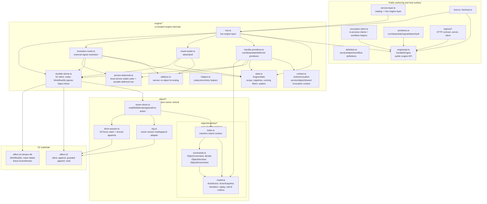
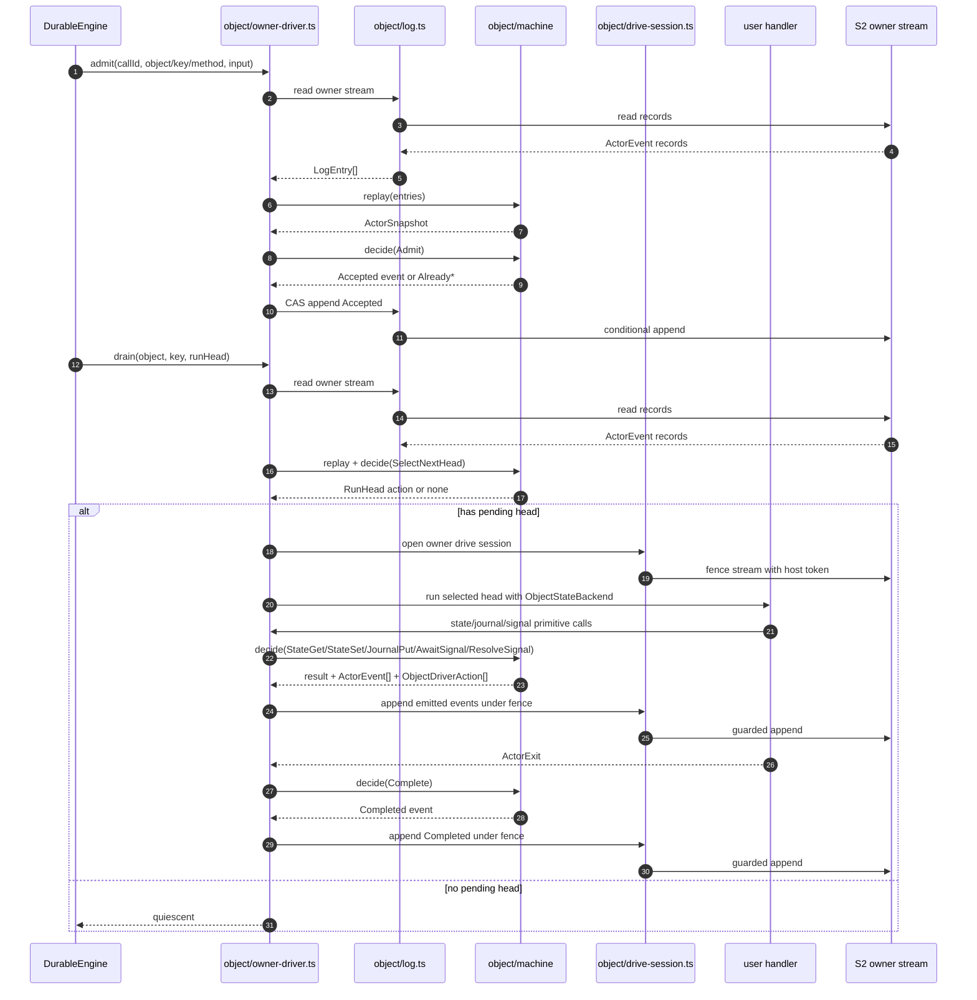
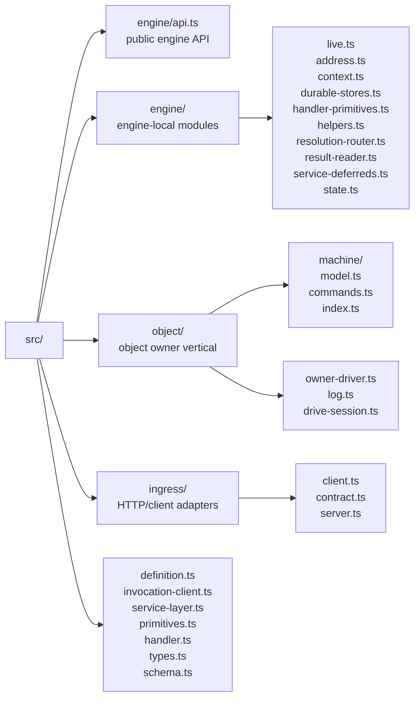

# Architecture Diagram

This diagram reflects the consolidated layout after moving engine internals under
`src/engine/` and co-locating object protocol semantics under
`src/object/machine/`.

## Component View

## Object Owner Command Loop

The object path is the clearest expression of the intended architecture:

## Folder View

## Review Questions

- Should the next pass split `engine/live.ts` into executor modules, or should
  storage substrate work land first?
- Is `engine/durable-stores.ts` still too broad, or is that acceptable until the
  storage substrate work introduces `S2Access`, `ServiceStores`, and
  `ObjectStores`?
- Should `ObjectOwnerDriver` call only `decide(...)`, or is it acceptable for it
  to keep using typed helpers like `stateGet(...)` where that preserves better
  return types?
- Should `object/log.ts` move behind `effect-s2-stream-db` `EventStream` before
  snapshot/trimming work, or at the same time?
